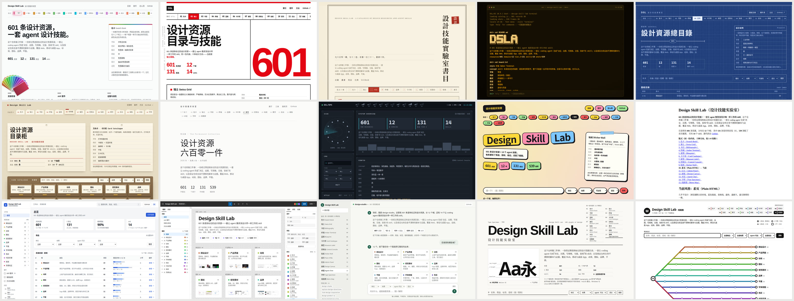

# Design Skill Lab

> A curated, tagged catalogue of 600+ design resources, plus an agent skill suite that makes a coding agent (Claude Code, Codex…) work like a senior designer: brief, references, several real directions, a design system, screens with every state, motion, icons, brand and graphics - then a handoff any implementer can build from, in any stack. Skills are written in English; analysis and this README are in Chinese.

**在线页面**：https://caocong1.github.io/design-skill-lab/ （可筛选的资源目录 + 套件导览；同一份内容可切换十种设计方向）

[](https://caocong1.github.io/design-skill-lab/)

这个仓库做三件事：

1. **一份资源目录**：601 条设计资源，逐条标了"适合查什么、怎么直达、授权、档位、agent 能否直接读到"。
2. **一套 skill**：让 agent 像资深设计师那样工作——决定、出图、写规格、交接、验收。
3. **证据与自检**：一手资料摘要、分主题分析，以及保证仓库自身不漂移的机械校验脚本。

结构沿用姊妹项目 [`ai-agent-skill-lab`](https://github.com/caocong1/ai-agent-skill-lab)：原始资料 → 分析 → skill → 可视化索引。

---

## 30 秒上手

```bash
git clone https://github.com/caocong1/design-skill-lab
cd design-skill-lab

# Claude Code
for d in skills/*/; do ln -sfn "$PWD/$d" "$HOME/.claude/skills/$(basename "$d")"; done
# Codex：把上面的 ~/.claude/skills 换成 ~/.codex/skills
```

子 skill 之间用 `../` 相对路径互相引用，所以**要装就装整套**（`iterate-design-lab` 只在维护本仓库时用，可以不链）。装好以后直接说需求：

```text
用 design-studio 根据这份需求给设备运维后台出一套完整设计，先给三个方向让我选。
```

```text
这是我们的官网 https://example.com ，用 find-design-inspiration 找参考，告诉我首屏和导航可以怎么改。
```

```text
给我们的 Flutter 巡检 App 设计设备列表页，手机和平板各一版；再用 handoff-design 打包给开发。
```

```text
用 critique-design 走查 src/views/dashboard，输出带证据和优先级的评审报告。
```

在宿主项目里，设计产物默认写到 `.design/`（brief、决策记录、方案板、设计系统、页面样稿、动效演示、图标、交接包、评审报告）。

---

## 套件的角色：设计师，不是前端工程师

- **它负责**：读懂需求、找参考、出多个方向、定设计系统、画页面与全部状态、做动效 / 图标 / 品牌 / 平面、评审、写交接规格、凭截图验收。
- **它不负责**：在目标技术栈里实现与测试——那是 coding agent 或开发者的事。
- **媒介永远是 HTML / CSS / SVG 渲染成 PNG**，就像人类设计师用同一个画布工具画所有平台。这同时也是任何 coding agent 都读得懂、能翻译成 Flutter / SwiftUI / Compose / ArkUI / 小程序的描述。
- **目标平台只改变三样东西**：画框（尺寸、安全区、系统栏）、惯例（导航结构、手势、系统组件）、约束（字体、图标体系、最小点击区）。按目标的逻辑尺寸作画，单位一一对应：1 px = 1 pt = 1 dp = 1 vp = 1 个 Flutter 逻辑像素；375 宽小程序里 = 2 rpx。

各平台的画框由样机套件提供：`skills/design-product-ui/assets/mockup-kit/kit.css`（示例 `skills/design-product-ui/assets/mockup-kit/demo.html`：同一套 token，排进 iOS、Android、鸿蒙、小程序和桌面窗口）。

## skill 一览

| 你想要 | 用这个 skill |
| --- | --- |
| 不确定从哪开始 / 一套完整设计 | `design-studio`（入口，会自己路由） |
| 把模糊需求变成 brief，出 2–4 个**真正不同**的方向并收敛 | `explore-design-directions` |
| 找参考、拆竞品、提取风格 DNA、给现有网站出改进思路 | `find-design-inspiration` |
| App / 后台 / 小程序 / 桌面端的页面、组件、流程与全部状态；数据大屏；AI 产品界面 | `design-product-ui` |
| 落地页、官网、作品集 | `design-marketing-sites` |
| token、色彩与字体体系、组件规格、暗色模式、`DESIGN.md`、清点代码里散落的颜色间距 | `build-design-system` |
| 动效：要不要动、怎么动、规格表、可慢放的演示 | `design-motion` |
| 选图标家族、补图标、画图标集、应用图标与 favicon | `design-icons` |
| Logo、识别系统、品牌规范、品牌重塑 | `design-brand-identity` |
| 海报、社媒图、OG 图、演示文稿、印刷物、生成式背景 | `design-graphics` |
| 走查现有设计、设计验收 | `critique-design` |
| 把设计交给开发：验收图、样稿、token、全状态规格、切图 | `handoff-design` |
| （给实现者）在具体技术栈里忠实落地 | `implement-design` |
| 维护本仓库：加资源、加来源、验链 | `iterate-design-lab` |

套件的三个支点：

- **渲染并查看。** 没有渲染并看过的设计只是猜测；没验证的要如实说没验证（`skills/design-studio/references/render-and-look.md`）。
- **能算的不估。** 对比度与色阶由 `skills/design-studio/scripts/color_tools.py` 计算，多视口截图由 `skills/design-studio/scripts/shot.sh` 完成。
- **耐久与易腐分开。** 感知、层级、排版、无障碍、流程写在 `SKILL.md` 与基础参考里；平台规格、库 API、社媒尺寸、"生成感"特征清单放在带复核日期的参考文件里。

它也覆盖资深设计师会做、但需求里通常不写的事：保留资产的重设计、竞品拆解、状态矩阵、token 漂移审计、中文排版与字体授权、平台适配、授权台账、设计决策记录。完整说明见 `analysis/11-distilled-skill-design.md`。

## 资源目录

`catalog/resources.jsonl` 是单一事实来源（601 条；S 131 / A 374 / B 96），分 12 个域：网站、产品界面、动效、图标、视觉素材、品牌、平面、字体与排版（含中文字体与排版）、色彩、代码与开源项目、阅读、社区与聚合。

每条记录的标记：

| 字段 | 含义 |
| --- | --- |
| `best_for` / `how_to_use` | 设计师会为了什么来这里；怎么直达正确的页面（筛选维度、可深链的 URL 模式、API 与原始文件端点） |
| `tier` | `S` 同类首选 / `A` 可靠 / `B` 小众或有明显短板 |
| `access` / `login` / `license` | 免费、部分免费、付费；是否需要登录；素材、字体、图标、代码的授权事实 |
| `agent_access` | 由脚本实测写入：`static` 可直接抓取 / `js` 需要浏览器 / `blocked` 有反爬或登录墙 / `unknown` 未能核验 |
| `origin` | `user-…` 你提供的站点 / `research-…` 调研发现 |

怎么看：打开[在线页面](https://caocong1.github.io/design-skill-lab/)筛选和搜索；agent 运行时读的是生成出来的 `skills/design-studio/references/resources/*.md`。

怎么加：对 agent 说"用 iterate-design-lab 把这几个站点加进目录：……"。它会查重、实际访问、写条目、验链、重建视图并跑校验。

## 仓库结构

```text
catalog/          资源目录（resources.jsonl）与分类法（sections.json）
skills/           design-studio 入口 + 12 个子 skill + iterate-design-lab
raw/docs/         一手资料的转述式结构化摘要（带来源 URL 与抓取日期，非原文镜像）
raw/research/     调研简报、候选数据 schema、首轮调研留下的候选域名
analysis/         12 篇中文分析 + SOURCE_INDEX.md（来源版本与新鲜度审查）
docs/             在线页面：index.html、app.js、base.css、styles/*.css、生成的 catalog.js
scripts/          build-catalog.py、check-links.py、check-lab-invariants.sh
.planning/        验链报告与触发式 seed
```

快速阅读路径：`analysis/10-overall-design-synthesis.md` → `skills/design-studio/SKILL.md` → `analysis/02-ai-design-skills-survey.md` → `analysis/11-distilled-skill-design.md`。

## 脚本

```bash
# 对比度（WCAG 比值 + APCA Lc），低于阈值时退出码为 1
skills/design-studio/scripts/color_tools.py contrast "#6b7280" "#ffffff"
# 前景 × 背景对比度矩阵
skills/design-studio/scripts/color_tools.py matrix --fg "#111827,#6b7280" --bg "#ffffff,#f3f4f6"
# 从一个种子色生成感知均匀的 11 级色阶（--neutral 中性灰，--dark 暗色镜像，--format css|json）
skills/design-studio/scripts/color_tools.py scale "#3b82f6" --name blue
# 多视口截图（390 / 768 / 1280 / 1920，2x；--dark 暗色，--full 整页）
skills/design-studio/scripts/shot.sh page.html .design/shots

# 维护
scripts/build-catalog.py            # 从目录生成 skill 参考文件与页面数据（--check 校验是否过期）
scripts/check-links.py --write      # 机械验链并写入 agent_access；约两分钟，不消耗模型额度
scripts/check-lab-invariants.sh     # 提交前必须干净退出的机械闸
```

全部只依赖 Python 标准库、curl 和一个 Chromium 系浏览器。

## 在线页面的十种风格

页面是用套件自己的流程做的（brief → 选轴 → 方向 → 渲染 → 看图修正），过程记录在 `analysis/12-dogfooding-the-lab-page.md`。同一份内容、同一套 DOM，十个方向在**字体气质、色彩策略、版式语法、密度、形状、层次**上拉开，而不是换配色；页眉的说明卡就是"方案板"上每个方向该带的那张卡：概念、各轴取值、以及它会在哪里失败。

`1 色卡` `2 瑞士` `3 书目` `4 终端` `5 蓝图` `6 卡片柜` `7 展签` `8 控制台` `9 贴纸` `0 素页` —— 页面底部切换，或直接按数字键；风格与筛选条件都保存在地址栏。

全部只用系统字体：离线、以及字体 CDN 不可用的网络下都能正常显示。每种风格的文字对比度都经脚本实测达到 WCAG AA。

## 这个项目不做什么

- **不是用户研究套件**：不组织访谈、问卷与可用性测试。
- **不替代商标检索与法律意见**：skill 会明确提示做专业检索；授权说明是常见模式，不是法律结论。
- **不负责在目标技术栈里实现与测试**：交出的是一份让实现变得容易的契约，并凭截图验收。（同一个 agent 被要求顺便实现时，用 `implement-design`。）
- **不驱动 Figma 等设计工具**（除非宿主环境提供了桥接）：产物是 HTML / CSS / SVG 样稿及其 PNG、token、规格文档。
- **不承诺易腐内容的时效**：平台像素规格、库 API、社媒尺寸、AI 界面模式都标了复核日期，使用前以官方页面为准。
- **不做自动化来源摄取**：判断什么值得收、放在哪、给什么档位，是这个仓库的全部价值。
- **不发布为可安装包**；**不维护多语言平行译本**（分析用中文，skill 用英文）。

## 已知局限

- **这套 skill 还没有被系统评测过。** 目前唯一的真实任务记录是给自己做的这个页面（`analysis/12-dogfooding-the-lab-page.md`），没有验证集，也没有"用与不用"的对比。
- **证据等级不均。** 排版、色彩、动效、token、图标规则有一手摘要支撑；平台规范（Apple HIG、Material 3、HarmonyOS）、品牌、平面、营销站点、数据大屏主要来自通识，未经本仓库核验。逐文件的证据等级见 `skills/design-studio/references/source-map.md`。
- **目录档位是单人判断**；国内资源覆盖薄于英文资源；少数站点在维护者网络下 TLS 不可达，标为 `unknown`，不代表已下线。
- **样机框是结构示意**，不是官方 UI kit；鸿蒙的画框与栏高为近似值。
- **页面的字体效果只在 macOS 上看过**；Windows 与 Linux 会落到各自的系统字体，气质相近但不相同。

## 版本与许可

skill 版本记录在各 `SKILL.md` frontmatter 的 `metadata.version`（`design-studio` suite 当前 0.4.0），遵循语义化版本，作用于契约（模式、交付物、产出目录结构、reference 路径）；`0.x` 期间契约仍在定型。每次迭代记录在 `CHANGELOG.md`；逐来源的版本与新鲜度审查在 `analysis/SOURCE_INDEX.md`。

原创内容（skill、脚本、目录条目、分析、页面）以 [MIT](LICENSE) 许可发布；许可范围与第三方材料的说明在 [NOTICE](NOTICE)。目录中出现的站点名称、商标归各自所有者；`raw/docs/` 是第三方作品的转述式学习摘要，原文版权归原作者，其中 `raw/docs/shape-of-ai.md` 随其来源以 CC BY-NC-SA 提供。

### 维护检查清单

- 改了 `catalog/` 之后运行 `scripts/build-catalog.py`，生成文件与 JSONL 一起提交。
- 新条目运行 `scripts/check-links.py --write --ids <id>`；`agent_access` 只由脚本写。
- 提交前 `scripts/check-lab-invariants.sh` 必须干净退出。
- `design-studio` 的 `metadata.version`、本 README 与 `CHANGELOG.md` 三处版本一致。
- 新分析文件第 3 行是元数据块，并以 `## 对最终 skill 的影响` 结尾，内容与实际提交一致。
