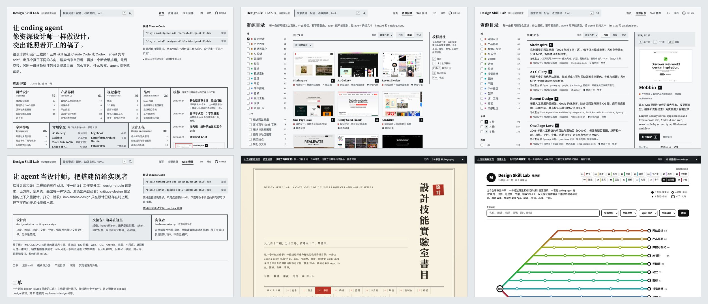

# Design Skill Lab

> A designer for coding agents (Claude Code, Codex…): three skills that take any design intent from brief to handoff, review a design or a build with a fresh eye, and build an existing design in your stack; plus a hand-curated, bilingual catalogue of 800+ design resources, an evidence layer of primary-source digests, and an eval harness. Skills are written in English; this README and the research syntheses are in Chinese.

**在线页面**：https://caocong1.github.io/design-skill-lab/ （首页 · [资源目录](https://caocong1.github.io/design-skill-lab/catalog/) · [套件导览](https://caocong1.github.io/design-skill-lab/skills/) · [十六种方向的实验页](https://caocong1.github.io/design-skill-lab/lab/)）

[](https://caocong1.github.io/design-skill-lab/)

这个仓库做四件事：

1. **一套 skill**：让 agent 像资深设计师那样工作——读懂需求、找参考、出几个真正不同的方向、定设计系统、画全部状态、交接，并在新的上下文里独立评审。三个 skill：`design-studio`、`critique-design`、`implement-design`。
2. **一份资源目录**：812 条设计资源，分 15 个域、83 个小节（2026-09-27 的数字；准确值以 `docs/data/catalog.json` 为准）。逐条写明适合查什么、怎么直达、授权、档位、agent 能不能直接读到，中英双语，每条都有缩略图或排字卡。
3. **证据层**：40 份一手来源的转述式摘要、9 篇中文主题综合和现场记录。skill 里每条带数字的规则都能追到来源，并且带复核期限。
4. **评测与闸门**：6 份固定 brief 的盲评、100 条触发测试，以及 9 道机械闸门和 CI，保证仓库自身不漂移。

---

## 30 秒上手

**Claude Code 插件**（推荐）：

```text
/plugin marketplace add caocong1/design-skill-lab
/plugin install design-skill-lab@design-skill-lab
```

**Codex 或手动安装**：把 `skills/` 下的三个目录整套链进去。

```bash
git clone https://github.com/caocong1/design-skill-lab
cd design-skill-lab
mkdir -p ~/.claude/skills                       # Codex：~/.codex/skills
for d in skills/*/; do ln -sfn "$PWD/${d%/}" ~/.claude/skills/"$(basename "$d")"; done
```

最好整套装：critique-design 和 implement-design 会读 design-studio 的参考文件和脚本。单独装时，它们的 SKILL.md 也能独立使用。用符号链接安装还有一个好处：`git pull` 就是升级，反馈也能写回本仓库（见下文"使用反馈"）。

从 0.7.x 升级：原来的 10 个子 skill 已经并入 design-studio，`iterate-design-lab` 移到了 `.claude/skills/`。清理失效链接的命令和旧名字的去向见 `CHANGELOG.md` 0.8.0 的"弃用与迁移"。

装好以后直接说需求，不用点名 skill：

```text
根据这份需求给设备运维后台出一套完整设计，先给三个方向让我选。
```

```text
这是我们的官网 https://example.com ，找几个参考，告诉我首屏和导航可以怎么改。
```

```text
我们的巡检 App 整体 UI 优化一下，现有页面在 src/pages/ 下。
```

```text
给我们的 Flutter 巡检 App 设计设备列表页，手机和平板各一版，最后打一个交接包。
```

```text
走查 src/views/dashboard 的界面，输出带证据和优先级的评审报告。
```

```text
照 .design/handoff/tickets/ 的交接包，用 Vue 3 + Element Plus 把工单页实现出来，截图对照验收。
```

## 三个 skill

| skill | 版本 | 什么时候用 |
| --- | --- | --- |
| `design-studio` | 0.8.4（suite 版本） | 一切设计意图：完整设计；单个页面、组件、流程、动效、图标、Logo、海报；多套方案；找灵感；整体重设计；设计系统；交接包 |
| `critique-design` | 0.2.1 | 评审、走查、打分、无障碍检查、按交接截图验收实现；也是 design-studio 在新上下文里调用的独立评审 |
| `implement-design` | 0.3.0 | 已经有设计稿、交接包或样稿，要在具体技术栈里实现，并用截图证明还原度 |

**模式**（契约，名字不变）：`full`、`piece`、`options`（可以叠加在任何模式上）、`inspire`、`critique`、`redesign`、`handoff`、`implement`。"整体 UI 优化""改版"按 `redesign` 处理，从产品的功能重新出发，而不是打磨细节。

**投入档位**按范围选，agent 会说明选了哪一档：

| 档位 | 范围 | 做什么 |
| --- | --- | --- |
| `quick` | 一个组件、图标、小改动、单张图 | 读 → 画 → 渲染 → 底线检查 → 交付 |
| `standard` | 一个页面、流程、品牌物料、找灵感、交接 | quick 之外，看参考、定一小片系统（token）、独立评审、拔高一轮 |
| `deep` | 完整设计、重设计、多个界面或多个目标平台 | 完整的 12 步循环，发散和评审用隔离的子 agent |

**循环**（deep 走全程）：看宿主 → 真相文件（PRODUCT.md、brief、每个界面一份契约）→ 采集参考、出联系表 → 发散（找出品类的惯性 → 参照 → 带种子的随机抽取 → 每个方向一个隔离的子 agent → 方案板）→ 收敛（用户选）→ 系统（DESIGN.md + token）→ 按契约画 → 渲染与底线检查 → 在新上下文里独立评审 → 拔高 → 交付或交接 → 复盘。验证有上限：一轮批量截图、一批修复、至多一轮确认，剩下的如实交代。完整契约在 `skills/design-studio/SKILL.md`（200 行以内）。

**迭代用语**：`bolder`、`quieter`、`distill`、`harden`、`clarify`、`typeset`、`recompose`、`colorize`、`delight`。一个词对应一种改法，其余不动。比如"标题区 typeset 一下"。

维护本仓库用的 `iterate-design-lab`（0.3.0）在 `.claude/skills/`，只在本仓库里可用，不随插件安装。

### 角色：设计师，不是前端工程师

- **它负责**：读懂需求、找参考、出方向、定系统、画页面与全部状态、做动效 / 图标 / 品牌 / 平面、写交接规格、评审与验收。实现是 coding agent 或开发者的事；同一个 agent 被要求顺便实现时，交给 implement-design。
- **契约媒介是 HTML / CSS / SVG**，按目标的逻辑尺寸画，渲染成 PNG 再看。它能描述任何目标：Web、iOS、Android、鸿蒙、小程序、桌面、大屏、对话宿主。宿主有生图模型时，可以用它出方向效果图和位图素材，但必须记录模型、提示词、日期和授权，HTML 仍是契约。
- **目标平台只改变画框、惯例和约束**，不改变方法和标准。平台参考在 `skills/design-studio/references/platforms/`（iOS 26–27 Liquid Glass、Android 16 / Material 3 Expressive、HarmonyOS 5/6、小程序、桌面、Web、嵌入宿主），样机套件在 `skills/design-studio/assets/mockup-kit/`。
- **能算的不估**：对比度、色阶、色觉模拟用 `color_tools.py` 算；截图和联系表用 `capture.mjs`；渲染后的页面用 `lint.mjs` 做确定性底线检查（见下文"脚本"）。

### 产出目录

宿主项目里默认写到 `.design/`：

```text
.design/
  PRODUCT.md  brief.md  function-map.md  decisions.md
  surfaces/<surface>.md          每个界面一份契约（0.8.0 新增）
  inspiration/<topic>/           笔记、截图、联系表
  directions/<round>/            方案板 index.html 与方向卡
  system/                        DESIGN.md、tokens、preview.html
  screens/ motion/ icons/ brand/ graphics/
  handoff/<feature>/             规格、handoff.json、截图、素材、验收报告
  critique/<date>-<target>/      评审报告与精选证据截图，入库（0.8.0 新增）
  shots/                         批量截图，不入库
```

`PRODUCT.md` 也是 0.8.0 新增的。宿主项目自己有约定（例如 design/、docs/design/、.stitch/ 目录，或 AGENTS.md、CLAUDE.md 里的说明）时照宿主的来；宿主已有 `DESIGN.md`、token 文件或主题化组件库时原地更新，不另起一套。每个文件都有模板，在 `skills/design-studio/templates/`：抄结构，不抄里面的值。

## 资源目录

**文件**

| 文件 | 谁写 | 内容 |
| --- | --- | --- |
| `catalog/resources.jsonl` | 人工策展（唯一手改的数据） | 一行一条资源，schema v2 |
| `catalog/taxonomy.json` | 人工 | 15 个域、83 个小节、`kind` 枚举，都有中英标题与说明 |
| `catalog/shot-overrides.json` | 人工 | 个别站点的截图修正：换地址、隐藏元素、等待、强制用 og 图或排字卡 |
| `catalog/observed.jsonl` | `scripts/check-links.py`，只追加 | 机器观测：`id`、`checked_at`、`http`、`final_url`、`agent_access`（static / js / blocked / unknown）、`title`、`note`；同一 id 以最新一条为准 |
| `docs/assets/thumbs/manifest.json` | `scripts/shoot-catalog.mjs` | 每条的缩略图来源（screenshot / github / og / placeholder）、尺寸、字节、抓取时间、最终地址、HTTP 状态、像素质检（`qa.verdict`、灰度标准差、边缘密度、主色占比）和尝试记录 |

**一行的字段**：`id`、`name`（可选 `name_zh`）、`url`、`domain`、`section`、`also`（第二归属，`域:小节`）、`kind`、`tags`（最多 6 个）、`best_for` / `how_to_use`（为什么来、怎么直达：筛选维度、深链写法、API）、`zh`（中文一句话，必填；可选 `zh_how`）、`access`（free / freemium / paid）、`login`、`license`、`tier`（S 同类首选，每个域不超过 15%，而且 agent 要能读到或有 `entry_points` / `api` / A 可靠 / B 小众或有明显短板）、`status`（active / slow / archived / sunset）、`lang`、`region`、`entry_points`、`api`、`caveats`、`origin`、`added`。

**生成物**（勿手改，`scripts/build-catalog.py` 把以上文件合在一起生成）：agent 运行时读的 `skills/design-studio/references/catalog/`（`catalog.jsonl` 投影、各域视图）；站点数据 `docs/data/`（`catalog.json`、`catalog.js`、`thumbs.js`、给实验页的 `lab-catalog.js`、给 agent 读的纯文本 `llms.txt`）；首页和目录页里 `<!-- gen:* -->` 之间的静态区块。

2026-09-27 的状态：S 档 92 条、A 档 587 条、B 档 133 条；agent 可达性（维护者网络下 curl 实测）static 628 条、js 121 条、blocked 60 条、unknown 3 条；缩略图 807 张通过质检（756 张截图、38 张 GitHub 社交卡、13 张 og:image），另外 5 条用排字卡。

**怎么查**：在线页面的[资源目录](https://caocong1.github.io/design-skill-lab/catalog/)（搜索支持中文、分面计数、键盘操作、URL 可分享）；agent 用 `python3 skills/design-studio/scripts/catalog.py find 配色 --domain color`，或用 `route "<问题>"` 找该看哪个域。
**怎么加**：在本仓库里对 agent 说"用 iterate-design-lab 把这几个站点加进目录：……"。它会查重、实际访问、写中英条目、验链、截图、重建，最后跑闸门。

## 证据层

- `research/sources/`：一份一手来源一个摘要。头部写 url、抓取日期、方法、复核期限；正文是转述，不做镜像。2026-09-27 共 40 份：16 份从旧摘要迁入并重读，24 份新增（Apple Liquid Glass、Material 3 Expressive、HarmonyOS、Fluent 2、WCAG 2.2 与各地无障碍法规、Web Baseline、DTCG 2025.10、DESIGN.md、MCP Apps / Apps SDK / A2UI、AI 标识法规、同类 skill、OOUX、变更厌恶、jlreq、CJK 字体授权）。新增的每份都由独立 agent 对照原文核对过。
- `research/topics/`：9 篇中文主题综合。每篇写当前结论、论证、未决问题、对 skill 的约束和变更记录。
- `research/field/`：现场证据，包括本站自用记录、匿名化的宿主复盘和评测汇总（`evals-2026-09-27.md`、`evals-2026-09-28.md`）。
- `research/INDEX.md`：由 `scripts/build-research-index.py` 生成，列出每份来源被哪些 skill 文件引用。复核期限一过，闸门就会失败。
- skill 的每份 reference 在 frontmatter 里写明证据等级（`digest` / `practice` / `measured`）、来源 id 和复核期限（易腐 +90 天，耐久 +365 天）。

说明见 `research/README.md`。

## 评测

- **输出评测**：6 份固定 brief（中文运维后台、开发者工具落地页、iOS 26 界面、小程序列表、agent 审批流、旧应用重设计），在"不装 skill / 装 0.7.0 / 装 0.8.0"三种条件下各做一遍。评审看不到来源，只凭 brief 和统一渲染的 PNG 按六个维度打分并两两比较；对比度、点击区域这类能测的，由脚本测好作为事实交给评审。
- **触发评测（代理）**：`evals/triggers.jsonl` 共 100 条中英请求，其中 45 条是近似但不该触发的请求或负例。一个模型只看三份 skill 描述，为每条请求选一个 skill 或选"都不用"。
- **首轮结果（2026-09-27，一格一个样本，评审与设计同为 claude-opus-5-5）：按事先定好的规则，三组之间都是“没有明确差别”，这一轮不能说装了套件就更好**。规则要求 6 份 brief 里至少赢 5 份，并且平均总分至少高 0.5。
  - 0.8.0 对不装 skill：赢 5 份、输 1 份，平均总分 4.17 对 4.00，只高 0.17，不到门槛。输掉的是开发者工具落地页，三位评审都偏好不装 skill 的一组（0:3）。
  - 0.7.0 对不装 skill：赢 2 份、输 4 份，3.94 对 4.00。
  - 0.8.0 对 0.7.0：赢 4 份、输 2 份（输在 iOS 界面和旧应用重设计），4.17 对 3.94。
  - 0.8.0 工艺均分 3.7，三组最低；每份花费约为不装 skill 的 2.2 倍（$3.62 对 $1.63），用时 1.7 倍。
  - 按套件自己的可证伪条件，要改的是套件。改什么见[完整报告](evals/runs/2026-09-27/report.md)第 8 节和 [research/field/evals-2026-09-27.md](research/field/evals-2026-09-27.md)。0.8.1 就是照这一节改的。
- **第二轮结果（2026-09-28，0.8.1 对不装 skill，一格三个样本，共 18 组盲评）：规则仍然不允许说“更好”，这次只差在分差上。**
  - 0.8.1 赢了全部 6 份 brief（每份按三个样本的多数算）、18 组里的 17 组、54 张评审票里的 49 张；按 brief 做的符号翻转检验 p = 0.031，这是 6 份 brief 能得到的最小值。
  - 平均总分 4.11 对 3.83，只高 0.28，不到规则要求的 0.5。规则是第一轮之前定的，不事后改，所以结论仍写“没有明确差别”，数字照列。
  - 两半规则打架的原因：648 个评分里 74% 是 4 分，评审之间从不相差超过 1 分，量表被压扁了；成对偏好比均分灵敏。重新标定量表是第三轮开始前要做的事，不是这一轮的结论。
  - 差距在贴合度（+0.68）和辨识度（+0.53）；层级持平；工艺 +0.09。输掉的唯一一组是审批流的第二个样本：有一个收款方被标了风险，套件样本仍把“整批通过”做成主按钮。它也是 18 次套件运行里唯一没有派出新上下文评审的一次。
  - 花费是不装 skill 的 2.0 倍（每次 $3.17 对 $1.55），用时也是 2.0 倍。
  - 这一轮查出评测工具自己的一个缺陷：`facts.mjs` 把帧底边上的一行深底浅字读成了白底，报出一条假的对比度失败（记在套件样本头上）。已修复并加了回归测试，两轮 54 份产物全部重测，只有这一条事实有变；受影响的那一组用正确的事实重评，旧评审存档但不计。见[报告](evals/runs/2026-09-27-r2/report.md)第 5 节和 [research/field/evals-2026-09-28.md](research/field/evals-2026-09-28.md)。
- **触发评测（代理）**：角色视图准确率 0.8.0 为 100%，0.7.0 为 99%。0.7.0 有两条“UI 打磨”类冲突行被判给了实现者（t041、t042）。0.8.0 的描述写在这套题之后，题目标签又按同一套角色定义写成，所以 100% 只能当上限看，不能当改进的证据。
- 各轮结果在 `evals/runs/` 和站点的[套件页](https://caocong1.github.io/design-skill-lab/skills/)，汇总写进 `research/field/`，输了也照样公布。方法见 `evals/README.md`，评审规则见 `evals/judging.md`。

## 使用反馈与自我迭代

套件在本地项目里使用时，如果 agent 能解析到本仓库的 `feedback/inbox/`（符号链接安装时可以），就会静默记下被纠正、指引出错、流程别扭、能力缺口和偏好，宿主项目只按形态描述，不写名字。`scripts/collect-feedback.py` 把它们聚合成 `feedback/report.md`；`iterate-design-lab` 的 evolve 模式分级消化。`scripts/evolve.sh` 可以挂 launchd 每周跑，但无人值守时只在 `evolve/<日期>` 分支上写提案和措辞修正，等主人合并。约定见 `feedback/README.md`。

## 仓库结构

```text
skills/                    随插件发布的三个 skill
  design-studio/           SKILL.md · references/（process、disciplines、platforms、fundamentals、catalog〔生成〕）
                           · templates/ · scripts/ · assets/mockup-kit/
  critique-design/         SKILL.md · references/（rubric、heuristics）· templates/（评审报告、评审子 agent 简报）
  implement-design/        SKILL.md · references/stacks.md
.claude/skills/            仓库内的维护 skill iterate-design-lab
.claude-plugin/            插件与市场清单（仓库根即插件根）
catalog/                   资源目录：事实来源、分类、机器观测、截图修正
research/                  证据层：sources/、topics/、field/、log.md、backlog.md、INDEX.md（生成）
evals/                     评测：briefs/、triggers.jsonl、评审协议、渲染与测量工具、runs/（各轮结果）
docs/                      GitHub Pages：首页、catalog/、skills/、lab/（十六种方向）、data/（生成）、assets/
scripts/                   仓库工具（见下）
feedback/                  使用反馈：inbox/、report.md（生成）、proposals.md、log.md、archive/
raw/repos/                 上游仓库的浅克隆（git 忽略；怎么重新克隆见 research/README.md）
.github/workflows/         CI：闸门 + 站点冒烟测试
package.json               固定版本的 Playwright 与 axe-core，只给仓库工具用
```

## 脚本

**skill 脚本**：在 `skills/design-studio/scripts/` 下，随 skill 发布，给宿主项目里的 agent 用。每个都支持 `--help`。

| 脚本 | 做什么 |
| --- | --- |
| `capture.mjs` + `lib/capture-core.mjs` | Playwright 截图：地址 × 视口 × 明暗 × 状态；复用登录态、校验构建标记、移除同意弹窗；遇到反爬页、空白页、报错页时以非零码退出；`--sheet` 出联系表 |
| `shot.sh` | 零依赖兜底（Chrome 命令行），检测项比 capture.mjs 少 |
| `lint.mjs` | 渲染后页面的确定性底线检查。不过就以退出码 1 结束的：文字对比度（计算加实测）、横向溢出、无名控件；只报警告的：点击区域、`transition: all`、减少动效、中文排版、token 漂移等 |
| `color_tools.py` | WCAG / APCA 对比度、OKLCH 色阶、色觉模拟 `cvd`、`matrix --from tokens.css` |
| `catalog.py` | 查资源目录：`find` / `show` / `route` / `recipes` / `domains`（标准库） |
| `seed.py` | 发散时的种子抽取：由 brief、轮次和用户种子决定哪些参照上方案板、谁领头 |
| `text_to_path.py` | 把字标按字体文件转成 SVG 路径（需要 venv 里的 fontTools） |

**仓库工具**：在 `scripts/` 下。

| 脚本 | 做什么 |
| --- | --- |
| `check-lab-invariants.sh` → `gates.py` | 完成的定义，G1–G9 九道闸门：资源目录与生成物 · 缩略图清单 · 来源头部与 INDEX · skill frontmatter、行数预算、reference frontmatter、链接与路径 · 反馈条目 · 触发测试集 · 版本一致 · `docs/` 不手写目录数字、链接可达 · 不跟踪杂散文件 |
| `build-catalog.py`（+ `site_pages.py`） | 校验目录并重建全部生成物；`--check` 只校验 |
| `check-links.py` | 用 curl 验链，结果追加到 `catalog/observed.jsonl`；识别挑战页、停放域名、软 404；按主机串行 |
| `shoot-catalog.mjs` | 缩略图：GitHub 仓库用社交卡，其余截图，截图失败或质检不过时退到 og:image，再退到排字卡；每次运行都复检已有文件 |
| `smoke-site.mjs` | 站点冒烟测试：控制台无报错、axe 无严重问题、390 和 320 宽无横向溢出、图片与链接可达、搜索黄金用例、首页体积预算、旧链接跳转、生成区块与数据一致 |
| `build-research-index.py` | 校验来源头部并生成 `research/INDEX.md` |
| `collect-feedback.py` · `evolve.sh` | 聚合反馈 · 无人值守的反馈消化（只出提案分支） |

依赖分三层，各管各的：skill 脚本只要 Python 标准库和一个 Chromium 系浏览器；`capture.mjs` 和 `lint.mjs` 需要 Playwright，项目里装了就用，没装时给出固定版本的 `npx` 命令，从不拉取未固定的版本。仓库工具里的 Python 全部只用标准库，截图和冒烟测试用 `package.json` 里固定版本的 Playwright。`evolve.sh` 需要本机装好 claude CLI。

## 这个项目不做什么

- **不是用户研究套件**：不组织访谈、问卷和可用性测试。
- **不替代商标检索和法律意见**：授权与法规说明是常见情形的整理，不是法律结论。
- **不负责在目标技术栈里实现和测试**：交出一份让实现变容易的契约，并凭截图验收；要实现时交给 implement-design。
- **不驱动 Figma 等设计工具**（除非宿主环境提供了桥接）：产物是 HTML / CSS / SVG 样稿及其 PNG、token 和规格文档。
- **不承诺易腐内容的时效**：平台规格、库 API、AI 界面模式都带复核期限，使用前以官方页面为准。
- **不做自动化来源摄取**：收什么、放哪、给什么档位，是这个仓库的价值所在。

## 已知局限

- **输出评测的评审是模型，brief 只有 6 份。** 评审和设计用的是同一个模型，没有人类评审；评分被压缩在 3–5 分之间。6 份 brief 是本仓库自己写的，0.8.1 的改动又来自第一轮在这 6 份上输掉的地方，第二轮等于在出题的卷子上复测；缺一套没读过 skill 的人写的留出 brief。两轮按事先登记的规则都是“没有明确差别”。以 `evals/runs/` 和套件页为准，包括输的部分。
- **触发评测是代理。** 模型只看三份描述、被要求必须选一个，所以会高估触发率，也看不出"该触发却没触发"；真实宿主还会看到其他已装的 skill 和项目上下文。结果只能叫"触发评测（代理）"，不是触发率。
- **平台事实是有日期的。** iOS 26–27、Android 16、HarmonyOS 5/6、Web Baseline 等内容写于 2026-09-27，易腐来源 90 天后到期，到期后闸门变红，直到有人复核。到期之前平台也可能已经变了。
- **证据等级不均。** 平台规范、标准、token 格式、动效有一手摘要；品牌、平面、营销站点的不少规则仍是业内共识（`evidence: practice`）。
- **deep 档依赖子 agent。** 隔离发散和独立评审要求宿主能开子 agent；不能开时 agent 在单一上下文里跑完并声明这一点，效果会打折扣。
- **宿主反馈只有两个项目**，而且都来自主人自己的项目。
- **目录档位是单人判断。** agent 可达性是维护者网络下 curl 的一次观测，换一个网络结果会变；国内资源（104 条）明显少于全球资源。
- **缩略图是 1280×800 的首屏。** 站点改版后会过时，每次运行都会复检像素；5 条拿不到可用图的用排字卡。
- **站点只在 macOS Chrome 上人工看过。** 中文用系统字体，Windows、Android 上的中文字形和行高没有核对过；CI 的冒烟测试在 Linux Chromium 上跑，只检查机械项。唯一的网络字体（拉丁 Source Serif 4）来自 jsDelivr，加载不到时退回系统衬线体。
- **样机框是结构示意**，不是官方 UI kit。

## 维护

完成的定义：`scripts/check-lab-invariants.sh` 退出码为 0（标准库、不联网、几秒内跑完）。CI 在每次 push 和 PR 上跑闸门和站点冒烟测试。

```bash
scripts/check-lab-invariants.sh              # G1–G9；也可以只跑几道：scripts/check-lab-invariants.sh G4 G7
scripts/build-catalog.py                     # 改了 catalog/ 之后重建全部生成物（--check 只校验）
scripts/check-links.py --ids a,b             # 验链并追加观测（不带 --ids 为全量；--dry-run 不写）
npm ci && npm run shoot -- --ids a,b         # 缩略图（--sheet review.png 出联系表供人工复核）
npm run smoke                                # 站点冒烟测试
python3 scripts/build-research-index.py      # 加了或复核了来源之后重建 research/INDEX.md
scripts/collect-feedback.py                  # 聚合反馈（--check / --archive / --import）
scripts/evolve.sh --dry-run                  # 看无人值守的反馈消化会做什么
```

按改动类型：

- **加资源**：写进 `catalog/resources.jsonl`（必须有 `zh`）→ `check-links.py --ids` → `npm run shoot -- --ids` → `build-catalog.py` → 闸门。
- **改 skill**：守住行数预算（design-studio 的 SKILL.md 200 行，另外两个 150 行，每份 reference 300 行）；reference 的 frontmatter 写好来源和复核期限；一条规则只在一个文件里写。
- **改站点**：`docs/` 里的目录数字只能由 `build-catalog.py` 写进 `<!-- gen:* -->` 区块；跑 `npm run smoke`；GitHub Pages 从 `main:/docs` 发布，Pages 构建显示 `built` 才算上线。
- **复核来源**：更新 `research/sources/<id>.md` 的 `fetched` / `review_by`，同步引用它的 reference，重建 INDEX，在 `research/log.md` 记一笔。
- **发版**：每次非琐碎提交都当场判断要不要升版本，一个闭环一个版本；suite 版本在 `skills/design-studio/SKILL.md`、本 README、`CHANGELOG.md` 顶部条目和 `.claude-plugin/` 两个清单里保持一致（闸门 G7）。

## 版本与许可

skill 版本记录在各 `SKILL.md` frontmatter 的 `metadata.version`（`design-studio` 的版本就是 suite 版本，suite 当前 0.8.4），遵循语义化版本，作用于契约（模式、交付物、产出目录结构、reference 路径）；`0.x` 期间契约仍在定型。每次迭代都记在 `CHANGELOG.md`；逐来源的抓取日期与复核期限见 `research/INDEX.md`。

原创内容（skill、脚本、目录条目、研究综合、评测、页面）以 [MIT](LICENSE) 许可发布；许可范围和第三方材料的说明见 [NOTICE](NOTICE)。目录里出现的站点名称和商标归各自所有者；`research/sources/` 是第三方作品的转述式学习摘要，原文版权归原作者，其中 `research/sources/shape-of-ai.md` 按其来源的 CC BY-NC-SA 许可提供。
