# Output eval, round 2026-09-27

Six fixed briefs, three arms (no skill, suite 0.7.0, suite 0.8.0), one sample per cell, 18 design runs judged blind by three model judges per brief. Protocol: [judging.md](../../judging.md). Data: [results.json](results.json) (validates against [results.schema.json](../../results.schema.json)), anonymisation in [mapping.json](mapping.json), isolation check in [isolation.json](isolation.json), identity-leak scan in [leaks.json](leaks.json). The Chinese field record is [research/field/evals-2026-09-27.md](../../../research/field/evals-2026-09-27.md).

## 1. Headline

**No claim passes the pre-registered rule this round.** The rule (judging.md section 9) allows "X is better than Y" only if X wins at least 5 of the 6 briefs against Y *and* its mean overall is at least 0.5 higher. No pair of arms meets both conditions, so every comparison is reported as "no clear difference":

| Comparison | Briefs (wins-losses-ties) | Mean overall | Difference | Rule result |
|---|---|---|---|---|
| suite-0.8.0 vs no-skill | 5-1-0 | 4.17 vs 4.00 | +0.17 | no clear difference |
| suite-0.7.0 vs no-skill | 2-4-0 | 3.94 vs 4.00 | -0.06 | no clear difference |
| suite-0.8.0 vs suite-0.7.0 | 4-2-0 | 4.17 vs 3.94 | +0.23 | no clear difference |

- **suite-0.8.0 vs no-skill: 5-1 on briefs, but only +0.17 on the mean.** It passes the brief count and fails the margin. Even the brief count is weak evidence on its own: with one sample per cell a 5-1 split has a two-sided sign-test p of about 0.22.
- **suite-0.8.0 lost brief 02 (developer-tool landing page) to no-skill 3-0**, on the first desktop screen, mobile content and craft. See section 4.
- **suite-0.7.0 lost to no-skill on 4 of 6 briefs** (01, 02, 04, 05) and its mean overall is 0.06 lower. Under the rule this is still "no clear difference", but the direction is against 0.7.0.
- **suite-0.8.0 vs suite-0.7.0: 4-2.** suite-0.7.0 won briefs 03 (iOS) and 06 (legacy redesign) against 0.8.0.
- **Brief winners:** suite-0.8.0 3 (01, 04, 05), suite-0.7.0 2 (03, 06), no-skill 1 (02). Every brief had a Condorcet winner; no cycles, no tied pairs.
- **Cost:** suite-0.8.0 cost 2.2 times the dollars of no-skill ($3.62 vs $1.63 per brief) and took 1.7 times the wall time (11.8 vs 7.0 minutes per brief). suite-0.7.0 sat between ($2.66, 9.4 minutes). Section 6.
- **Falsifiability condition.** The suite's own condition (evals/README.md, honesty rule) is that if independent judges do not score the suite above no suite, the suite is what changes. This round they did not do so by the pre-registered margin. Section 8 lists the changes.

### Trigger eval (proxy), same date

Routing was measured separately with the proxy method in [run_triggers.md](../../run_triggers.md): a fresh model sees only the skill names and descriptions plus one request and names a skill or `none`. 100 rows, 3 runs each; 99 rows are scored (t038 is ambiguous and reported only). Full tables: [triggers-0.8.0.md](triggers-0.8.0.md), [triggers-0.7.0.md](triggers-0.7.0.md).

| Suite | Role-view accuracy (297 samples) | Majority-vote accuracy (rows) | Identical across runs | False triggers | Misses | Wrong skill | Collision rows right (majority) |
|---|---|---|---|---|---|---|---|
| 0.8.0 | 100.0% | 100.0% | 100.0% | 0.0% | 0.0% | 0.0% | 15 of 15 |
| 0.7.0 | 99.0% | 99.0% | 98.0% | 0.0% | 0.0% | 1.5% | 14 of 15 |

- 0.7.0's misrouted rows are both known collision rows, both UI-polish requests that went to the implementer: **t041** "can you do a UI polish pass across the whole app? …" (implement-design, implement-design, design-studio: wrong by majority) and **t042** "Make this page look nicer: src/app/settings/page.tsx" (1 of 3 runs to implement-design). This is the overlap the 0.8.0 audit named ("implement-design's description says UI polish"). In 0.7.0's own 14 names (exact-skill view) accuracy is 95.3%, with 6 misrouted rows.
- **Ceiling caveat.** The 0.8.0 descriptions were written after this set existed, in the same repository, and the role labels were written from the same role definitions as the descriptions. 100% is an upper bound, not evidence that routing improved; that needs a blind-written held-out set. The proxy also forces a choice, so it overstates trigger rates and cannot see under-triggering. It is not a trigger rate.

## 2. Scoreboard

Means over six briefs of the per-brief dimension means (three judges each), 1-5, one decimal. Two-decimal values are in results.json.

| Arm | Fit | Hierarchy | Identity | Craft | Typography | Platform / A11y | Overall | Brief wins | $ per brief |
|---|---|---|---|---|---|---|---|---|---|
| no-skill | 4.3 | 4.3 | 3.2 | 4.0 | 3.9 | 4.3 | **4.0** | 1 | $1.63 |
| suite-0.7.0 | 4.4 | 4.0 | 3.2 | 4.0 | 3.9 | 4.2 | **3.9** | 2 | $2.66 |
| suite-0.8.0 | 4.7 | 4.4 | 3.7 | 3.7 | 4.3 | 4.2 | **4.2** | 3 | $3.62 |

Per brief, overall mean (winner in bold):

| Brief | no-skill | suite-0.7.0 | suite-0.8.0 | Winner |
|---|---|---|---|---|
| 01-ops-console-zh | 3.9 | 3.8 | **4.3** | suite-0.8.0 |
| 02-devtool-landing-en | **4.3** | 3.8 | 4.1 | no-skill |
| 03-ios-consumer-screen | 3.8 | **4.1** | 4.1 | suite-0.7.0 |
| 04-miniprogram-list-zh | 3.9 | 3.8 | **4.3** | suite-0.8.0 |
| 05-agent-approvals | 4.2 | 3.9 | **4.3** | suite-0.8.0 |
| 06-redesign-legacy | 3.8 | **4.2** | 3.8 | suite-0.7.0 |

Read the scores with the pairwise results, not instead of them. The judges used only 3, 4 and 5 (213 of 324 scores are 4, 61 are 5, 50 are 3), and no dimension ever had a spread above 1 between judges, so no disagreement flag (spread of 3 or more) was raised. The scale compressed: the pairwise preferences discriminate far more than the means do. Where the arms differ on the means, suite-0.8.0 is highest on Fit, Hierarchy, Identity and Typography and **lowest of the three on Craft (3.7)**; no-skill is highest on Platform / Accessibility.

## 3. Pairwise results

An arm wins a brief's pair when at least 2 of 3 judges prefer it (judging.md section 8).

| Pair | Wins | Losses | Ties | Briefs won by the first arm | Briefs lost |
|---|---|---|---|---|---|
| suite-0.8.0 vs no-skill | 5 | 1 | 0 | 01, 03, 04, 05, 06 | 02 |
| suite-0.7.0 vs no-skill | 2 | 4 | 0 | 03, 06 | 01, 02, 04, 05 |
| suite-0.8.0 vs suite-0.7.0 | 4 | 2 | 0 | 01, 02, 04, 05 | 03, 06 |

Judge votes per brief and pair (first arm - second arm - tie):

| Brief | no-skill vs 0.7.0 | no-skill vs 0.8.0 | 0.7.0 vs 0.8.0 |
|---|---|---|---|
| 01-ops-console-zh | 2-1-0 | 0-3-0 | 0-3-0 |
| 02-devtool-landing-en | 3-0-0 | 3-0-0 | 1-2-0 |
| 03-ios-consumer-screen | 0-3-0 | 1-2-0 | 2-1-0 |
| 04-miniprogram-list-zh | 2-1-0 | 0-3-0 | 0-3-0 |
| 05-agent-approvals | 3-0-0 | 1-2-0 | 1-2-0 |
| 06-redesign-legacy | 0-3-0 | 1-2-0 | 3-0-0 |

10 of 18 brief pairs were unanimous. No judge answered "tie" anywhere.

## 4. Per brief

### 01-ops-console-zh

Brief: [01-ops-console-zh.md](../../briefs/01-ops-console-zh.md). Mapping: A = suite-0.8.0, B = suite-0.7.0, C = no-skill.

**Winner: suite-0.8.0** (both pairs 3-0). no-skill beat suite-0.7.0 2-1. The detail page decided it: suite-0.8.0 and no-skill put the abnormal readings and the 55 °C threshold trend on the first screen, suite-0.7.0 pushed them below the processing log. Against no-skill, all three judges named the same difference: suite-0.8.0 labels every trend value, no-skill shows only the end value. suite-0.7.0 is the only arm here with measured contrast failures (9 text nodes, lowest 2.75:1).

| Arm | Fit | Hierarchy | Identity | Craft | Typography | Platform / A11y | Overall |
|---|---|---|---|---|---|---|---|
| no-skill | 4.3 | 4.3 | 3.0 | 3.7 | 3.7 | 4.7 | **3.9** |
| suite-0.7.0 | 4.0 | 4.0 | 3.0 | 4.0 | 4.0 | 3.7 | **3.8** |
| suite-0.8.0 | 5.0 | 5.0 | 3.0 | 4.0 | 4.3 | 4.7 | **4.3** |

First frames (canonical renders, `list-01.png`; full frames in each arm's `render/`):

| no-skill | suite-0.7.0 | suite-0.8.0 |
|---|---|---|
| 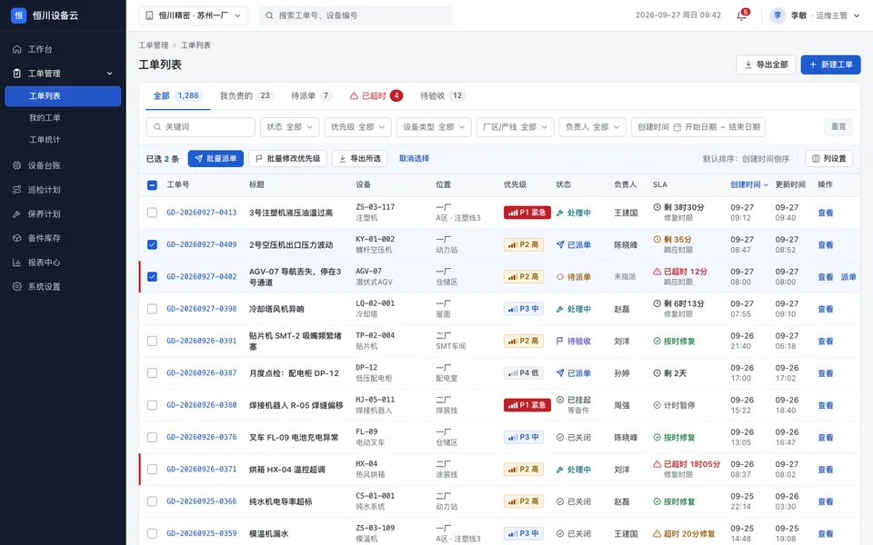 | 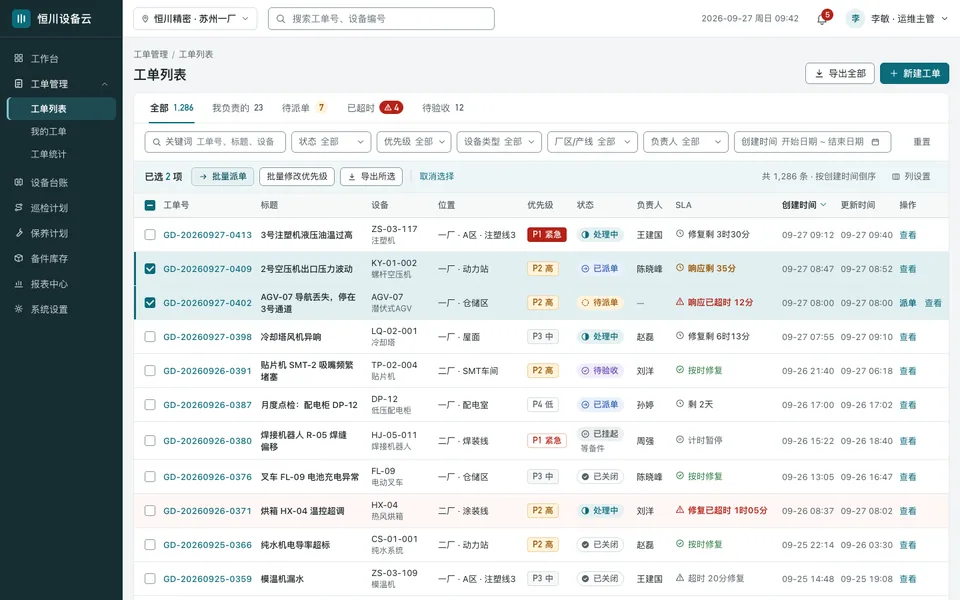 | 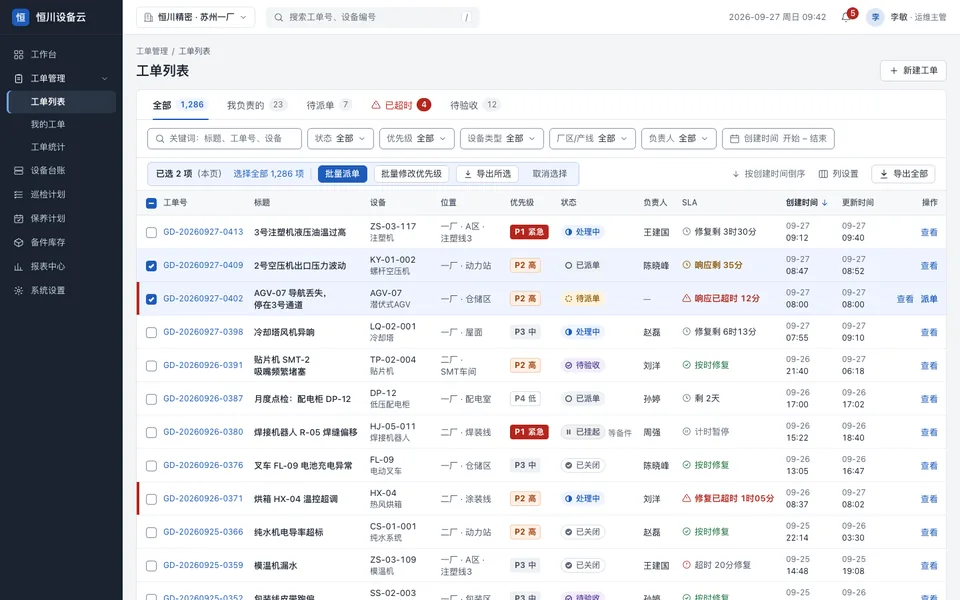 |

Judges' pairwise reasons (de-anonymised):

- J1, suite-0.7.0 vs no-skill: **no-skill**. C puts abnormal readings with deltas and the threshold trend on the detail first screen; B pushes them below the process log.
- J1, no-skill vs suite-0.8.0: **suite-0.8.0**. A's trend labels every value with a threshold-crossing summary and its batch bar offers select-all; C's chart has no point values.
- J1, suite-0.8.0 vs suite-0.7.0: **suite-0.8.0**. A shows readings and trend right under SLA on the detail; B hides the 68.4 °C reading below the fold.
- J2, no-skill vs suite-0.8.0: **suite-0.8.0**. A breaks titles cleanly and labels every chart point against the 55 °C line; C strands single characters in titles and its chart has no values.
- J2, no-skill vs suite-0.7.0: **suite-0.7.0**. B sets titles and single-line tabular dates cleanly; C's title column leaves orphaned characters (堵/塞, 3/号通道), a visible typesetting flaw across the list.
- J2, suite-0.7.0 vs suite-0.8.0: **suite-0.8.0**. A puts the readings and annotated trend chart right under the header; B pushes them below the processing log, out of the first screen.
- J3, suite-0.7.0 vs no-skill: **no-skill**. C keeps the readings table and the thresholded chart on the detail's first screen and adds non-colour priority glyphs; B pushes readings below the process log and has a failing separator contrast.
- J3, suite-0.7.0 vs suite-0.8.0: **suite-0.8.0**. A shows flagged readings and a fully labelled threshold chart above the fold with clean contrast facts; B buries readings on the second screen.
- J3, no-skill vs suite-0.8.0: **suite-0.8.0**. A labels every trend value and flags exceedances with icon + text cards; C's chart shows only the end value, so the rise cannot be read numerically.

Facts (evals/tools/facts.mjs @ f5c0421, judged area only):

- no-skill: 5 of 5 files, 8 frames, 0 console errors, 0 files with horizontal overflow; text below AA 0 of 700 (lowest 4.69:1); targets under 24 px failing the spacing exception 0.
- suite-0.7.0: 5 of 5 files, 8 frames, 0 console errors, 0 files with horizontal overflow; text below AA 9 of 688 (lowest 2.75:1); targets under 24 px failing the spacing exception 0.
- suite-0.8.0: 5 of 5 files, 8 frames, 0 console errors, 0 files with horizontal overflow; text below AA 0 of 761 (lowest 4.89:1); targets under 24 px failing the spacing exception 0.

Rationale check (judging.md section 10):

- no-skill: claims: 11 verified, 0 contradicted, 1 not checkable.
- suite-0.7.0: claims: 11 verified, 1 contradicted, 0 not checkable.
  - Contradicted: "对比度用脚本计算：正文 #1d2527 与各底色 ≥ 13:1，次要文字 #536266 ≥ 5.5:1，强调色/危险色/警告色/成功色文字在白底和对应浅底上均 ≥ 4.5:1；最浅的灰 #657578 只用在白底上（4.81:1）" Evidence: facts.json list.html: 4.07:1 (needs 4.5) span.none "—" #657578 on #e0eff1, 13px, so #657578 is also used on a tinted (selected-row) background, where it fails AA. Colours the claim does not mention also fail: breadcrumb separator "/" #8a979a on #f3f5f6 at 2.75…
- suite-0.8.0: claims: 10 verified, 2 contradicted, 0 not checkable.
  - Contradicted: "SLA 分级……超时后修复用红色常规字重加圆形感叹号" Evidence: render/list-02.png row 0359: 超时 20分修复 text is neutral grey (samples about rgb(130,138,150)), and only the circle-exclamation icon is red. A later line in the same NOTES.md (「超时 20分修复」改为中性文字加红色图标) matches the render, so this line is out of date.
  - Contradicted: "详情页：「更多」菜单下的「打印工单 / 复制链接 / 关闭工单」直接平铺在面包屑右侧，做成弱化的文字按钮……「关闭工单」用红字区分" Evidence: render/detail-01.png: the three actions are flattened as muted text buttons to the right of the breadcrumb, but 关闭工单… is neutral grey with a × icon, not red (text samples about rgb(90,100,116)). A later line in the same NOTES.md (「关闭工单…」改为中性色，带省略号) matches the…

Identity leaks: none. Reviewer-addressed text: none (leaks.json).

### 02-devtool-landing-en

Brief: [02-devtool-landing-en.md](../../briefs/02-devtool-landing-en.md). Mapping: A = no-skill, B = suite-0.7.0, C = suite-0.8.0.

**Winner: no-skill** (both pairs 3-0). This is the round's clearest loss for both suites. no-skill's first desktop screen holds the headline, the install command and the full code sample, and on mobile it keeps every feature and a sticky Get started header. suite-0.8.0 cut the code sample at the fold, truncated diagram labels, lost the plan CTAs on mobile and shipped a straight apostrophe and broken inline code (Craft 3.3). J2 still found it the most distinctive page (Identity 4.3), and it beat suite-0.7.0 2-1: suite-0.7.0 drops six of eight feature items at 390 px and reads as a generic slate-and-blue SaaS page.

| Arm | Fit | Hierarchy | Identity | Craft | Typography | Platform / A11y | Overall |
|---|---|---|---|---|---|---|---|
| no-skill | 5.0 | 5.0 | 4.0 | 4.0 | 4.0 | 4.0 | **4.3** |
| suite-0.7.0 | 4.0 | 4.0 | 3.0 | 4.0 | 3.7 | 4.0 | **3.8** |
| suite-0.8.0 | 4.3 | 4.0 | 4.3 | 3.3 | 4.0 | 4.3 | **4.1** |

First frames (canonical renders, `desktop-01.png`; full frames in each arm's `render/`):

| no-skill | suite-0.7.0 | suite-0.8.0 |
|---|---|---|
| 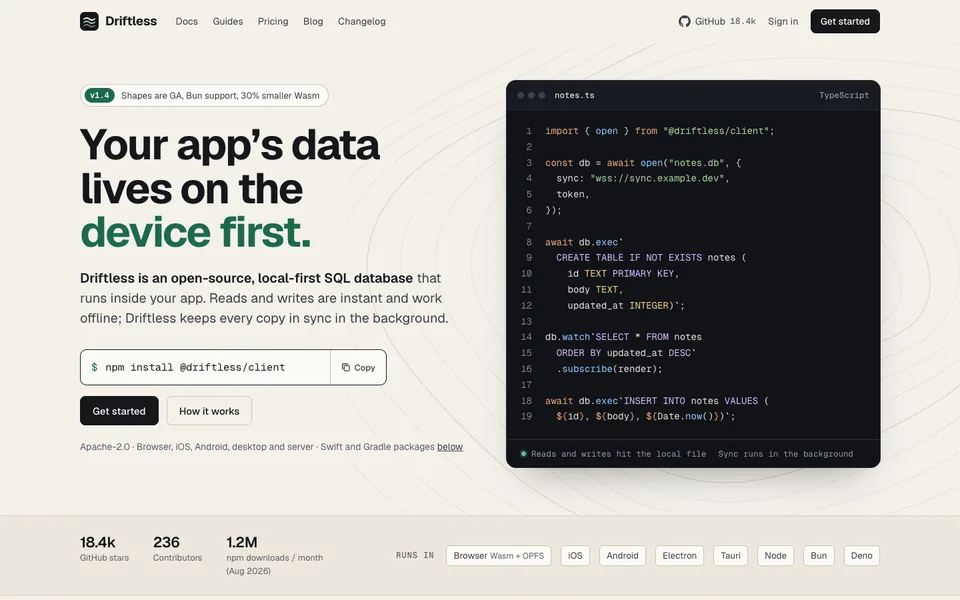 | 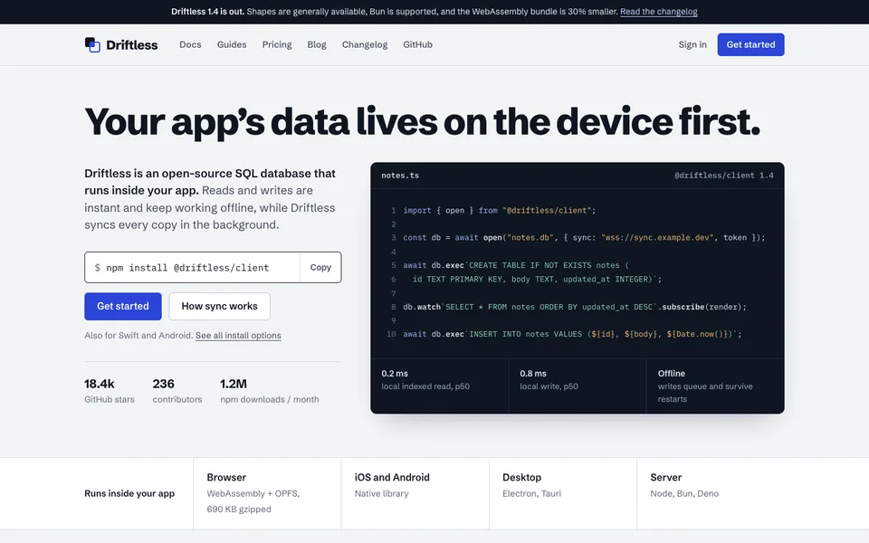 | 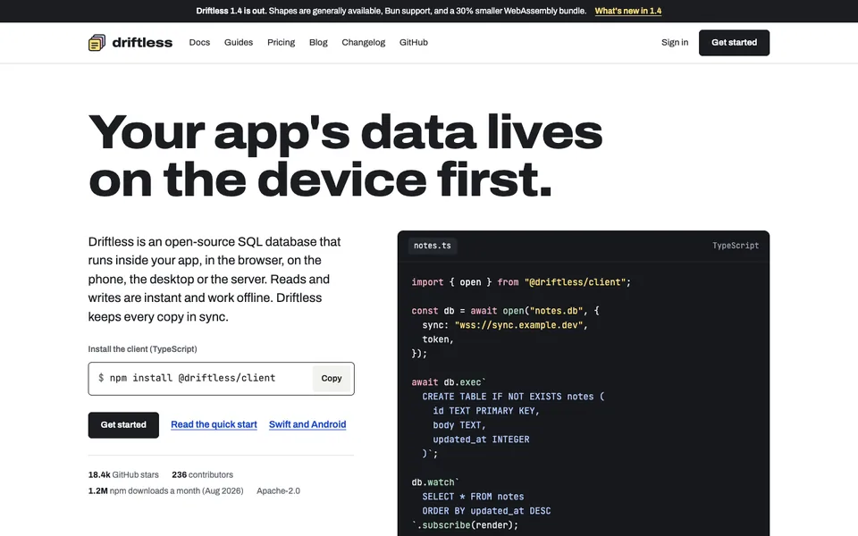 |

Judges' pairwise reasons (de-anonymised):

- J1, no-skill vs suite-0.8.0: **no-skill**. A shows the full code sample, install and CTAs in the first desktop screen and keeps a CTA on every plan; C's code runs below the fold and its diagram labels truncate.
- J1, suite-0.8.0 vs suite-0.7.0: **suite-0.7.0**. B's first desktop screen covers install, code, benchmarks and platforms, and its shape-filtering diagram explains sync more concretely; C cuts the code at the fold and loses mobile plan CTAs.
- J1, suite-0.7.0 vs no-skill: **no-skill**. A keeps every feature and a sticky Get started header on mobile; B drops six of eight feature items at 390 and has no persistent nav after the hero.
- J2, no-skill vs suite-0.8.0: **no-skill**. A's first screen holds the headline, install command and full code, with curly quotes and clean diagrams. C is more distinctive but has a straight apostrophe, broken inline code and a truncated label.
- J2, suite-0.7.0 vs no-skill: **no-skill**. A has its own character (warm paper, contour motif, forest green) and larger, well-set code. B reads as a generic slate-and-blue SaaS page with tiny long-line code.
- J2, suite-0.8.0 vs suite-0.7.0: **suite-0.8.0**. C's expanded display type and its yellow/pink/blue device colours make the page memorable and explain the merge. B could be any blue SaaS template.
- J3, suite-0.8.0 vs suite-0.7.0: **suite-0.8.0**. C keeps the full feature list on mobile, with a labelled Menu button and a Copy button on every install line; B drops six feature items at 390.
- J3, suite-0.8.0 vs no-skill: **no-skill**. A shows the full code and install in the first desktop screen and keeps a sticky Get started header on mobile; its only AA miss is a small diagram label.
- J3, no-skill vs suite-0.7.0: **no-skill**. A keeps all features and a persistent header on mobile, and its merge demo is concrete; B's mobile page hides most features and its nav scrolls away.

Facts (evals/tools/facts.mjs @ f5c0421, judged area only):

- no-skill: 1 of 1 files, 10 frames, 0 console errors, 0 files with horizontal overflow; text below AA 2 of 266 (lowest 4.24:1); targets under 24 px failing the spacing exception 0.
- suite-0.7.0: 1 of 1 files, 10 frames, 0 console errors, 0 files with horizontal overflow; text below AA 0 of 230 (lowest 5.09:1); targets under 24 px failing the spacing exception 0.
- suite-0.8.0: 1 of 1 files, 10 frames, 0 console errors, 0 files with horizontal overflow; text below AA 0 of 246 (lowest 5.75:1); targets under 24 px failing the spacing exception 0.

Rationale check (judging.md section 10):

- no-skill: claims: 11 verified, 0 contradicted, 1 not checkable.
- suite-0.7.0: claims: 12 verified, 0 contradicted, 0 not checkable.
- suite-0.8.0: claims: 10 verified, 2 contradicted, 0 not checkable.
  - Contradicted: "The first viewport shows what it is, the install command and the code sample." Evidence: desktop-01.png: what it is and the install command are there, but the code panel is cut by the fold after '.subscribe(render);'; the INSERT statement and caption only appear in desktop-02.png. mobile-01.png: only the code panel's 'notes.ts' tab row is visible;…
  - Contradicted: "Canary is now reserved for the laptop copy, not general UI accents." Evidence: The 'What's new in 1.4' link in the top announcement bar is set in the same canary (#FFE27A, sampled) as the Laptop header, on desktop-01.png and mobile-01.png. That link is a general UI accent, not the laptop copy. (Canary in the logo and code strings is cove…

Identity leaks: none. Reviewer-addressed text: none (leaks.json).

### 03-ios-consumer-screen

Brief: [03-ios-consumer-screen.md](../../briefs/03-ios-consumer-screen.md). Mapping: A = no-skill, B = suite-0.8.0, C = suite-0.7.0.

**Winner: suite-0.7.0** (3-0 over no-skill, 2-1 over suite-0.8.0). suite-0.8.0 beat no-skill 2-1. suite-0.7.0 won on an honest empty state that says what the app does, a week chart that marks Sunday as in progress, the full session history on the book detail, and 44 pt targets throughout. suite-0.8.0 has the best typography here (4.7: serif reading voice, J2 preferred it), but J1 and J3 preferred suite-0.7.0: sub-44 pt Log capsules (5 targets under 44 in the facts), a floating tab bar inside the home-indicator inset, and a book detail cut down to one last session (Platform / A11y 3.3, the lowest in the brief).

| Arm | Fit | Hierarchy | Identity | Craft | Typography | Platform / A11y | Overall |
|---|---|---|---|---|---|---|---|
| no-skill | 4.0 | 4.0 | 3.0 | 4.0 | 4.0 | 4.0 | **3.8** |
| suite-0.7.0 | 5.0 | 4.0 | 3.7 | 4.0 | 4.0 | 4.0 | **4.1** |
| suite-0.8.0 | 4.3 | 4.0 | 4.3 | 4.0 | 4.7 | 3.3 | **4.1** |

First frames (canonical renders, `today.png`; full frames in each arm's `render/`):

| no-skill | suite-0.7.0 | suite-0.8.0 |
|---|---|---|
| 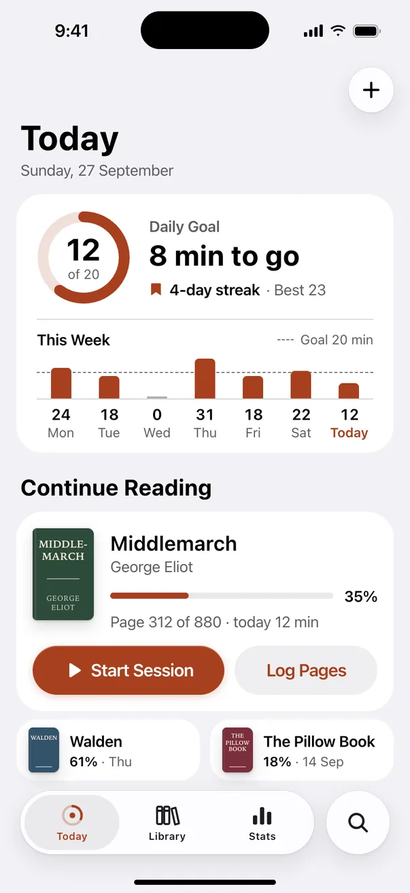 | 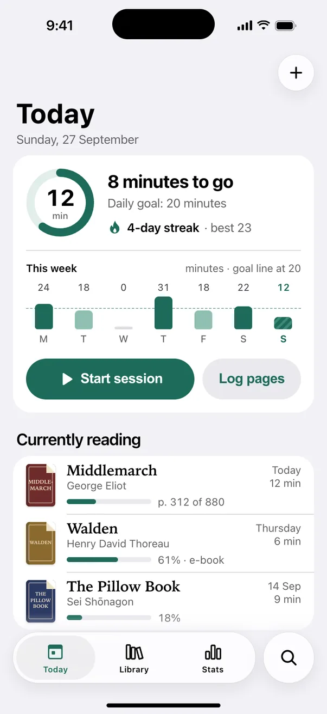 | 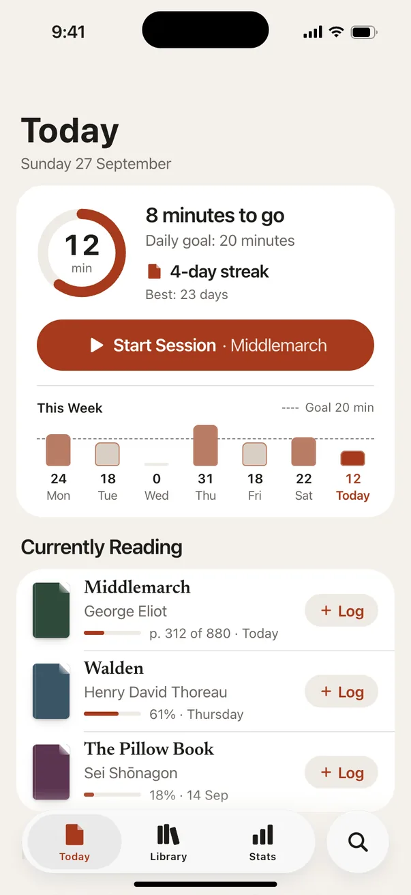 |

Judges' pairwise reasons (de-anonymised):

- J1, no-skill vs suite-0.7.0: **suite-0.7.0**. C's empty state explains the app and streak honestly, its week chart marks Sunday as in progress, and its book detail shows all four sessions.
- J1, no-skill vs suite-0.8.0: **suite-0.8.0**. B puts Start Session for Middlemarch right under the goal and lists every book with Log; A buries the action mid-screen and cramps the other books.
- J1, suite-0.7.0 vs suite-0.8.0: **suite-0.7.0**. C's book detail shows the full session history and its chart flags today in progress; B loses sessions and its tab bar crowds the home indicator.
- J2, suite-0.7.0 vs suite-0.8.0: **suite-0.8.0**. B's serif-set highlight quotation, warm paper ground and dog-ear motif give a reading voice; C is tidy but closer to a stock iOS template.
- J2, suite-0.8.0 vs no-skill: **suite-0.8.0**. B pairs serif titles and reading text with the UI sans and carries a product motif; A is all generic sans with plain cover placeholders.
- J2, suite-0.7.0 vs no-skill: **suite-0.7.0**. C's serif book titles, hatched in-progress bar and one-line app explanation on the empty state beat A's plainer type and thinner empty copy.
- J3, suite-0.7.0 vs suite-0.8.0: **suite-0.7.0**. C keeps every target at 44 pt and its tab bar clear of the home indicator; B's small Log capsules and low tab bar miss both.
- J3, no-skill vs suite-0.7.0: **suite-0.7.0**. C marks Sunday in progress with a pattern, lists all three books with their last session, and its empty state explains the app; A compresses two books.
- J3, suite-0.8.0 vs no-skill: **no-skill**. A's floating tab bar sits above the home indicator and its Today targets are full size; B has sub-44 Log buttons and a tab bar in the bottom inset.

Facts (evals/tools/facts.mjs @ f5c0421, judged area only):

- no-skill: 3 of 3 files, 3 frames, 0 console errors, 0 files with horizontal overflow; text below AA 0 of 99 (lowest 4.80:1); targets under 24 px failing the spacing exception 0; targets under 44 × 44: 2.
- suite-0.7.0: 3 of 3 files, 3 frames, 0 console errors, 0 files with horizontal overflow; text below AA 1 of 107 (lowest 4.05:1); targets under 24 px failing the spacing exception 0; targets under 44 × 44: 0.
- suite-0.8.0: 3 of 3 files, 3 frames, 0 console errors, 0 files with horizontal overflow; text below AA 0 of 85 (lowest 5.04:1); targets under 24 px failing the spacing exception 0; targets under 44 × 44: 5.

Rationale check (judging.md section 10):

- no-skill: claims: 9 verified, 1 contradicted, 2 not checkable.
  - Contradicted: "Text is at least 13 pt except the 10 pt tab labels" Evidence: render/today.png: cover lettering 'WALDEN' and 'THE PILLOW BOOK' is 5.5 px, 'GEORGE ELIOT' 7 px; render/book.png cover author 9 px (today.html/book.html inline styles). Decorative cover placeholders, not UI text; facts report no contrast failure for them
- suite-0.7.0: claims: 11 verified, 1 contradicted, 0 not checkable.
  - Contradicted: "Contrast (WCAG 2.2 AA): ... Secondary text #636366 ... This is the lightest text colour used ... tint and black labels are above 5:1" Evidence: facts.json today.html: 1 of 53 text nodes below AA, 'WALDEN' cover lettering #f3e6c8 on #8a6a2e at 4.05:1, 5.5 px. The named UI pairs hold (book.html lowest 5.25, matching tint on grey button; empty 5.25), but a lighter text colour than #636366 is used and fai…
- suite-0.8.0: claims: 11 verified, 0 contradicted, 1 not checkable.

Identity leaks: none. Reviewer-addressed text: none (leaks.json).

### 04-miniprogram-list-zh

Brief: [04-miniprogram-list-zh.md](../../briefs/04-miniprogram-list-zh.md). Mapping: A = no-skill, B = suite-0.7.0, C = suite-0.8.0.

**Winner: suite-0.8.0** (both pairs 3-0). no-skill beat suite-0.7.0 2-1. suite-0.8.0 leads each card with the next available time, fits four services on the first screen and offers a one-tap 改成明天 in the zero-result filter footer. Its chip targets are smaller: 19 targets under 44 × 44 in the facts against 0 for the other two, which J3 noted and still preferred it. no-skill beat suite-0.7.0 on check-marked filter chips (state not by colour alone) and tighter setting.

| Arm | Fit | Hierarchy | Identity | Craft | Typography | Platform / A11y | Overall |
|---|---|---|---|---|---|---|---|
| no-skill | 4.0 | 4.0 | 3.0 | 4.0 | 4.0 | 4.3 | **3.9** |
| suite-0.7.0 | 4.0 | 4.0 | 3.0 | 4.0 | 3.7 | 4.0 | **3.8** |
| suite-0.8.0 | 5.0 | 4.7 | 4.0 | 4.0 | 4.3 | 4.0 | **4.3** |

First frames (canonical renders, `list.png`; full frames in each arm's `render/`):

| no-skill | suite-0.7.0 | suite-0.8.0 |
|---|---|---|
|  |  |  |

Judges' pairwise reasons (de-anonymised):

- J1, no-skill vs suite-0.8.0: **suite-0.8.0**. C leads each card with the available time and fits four services incl. the 上门费 case; its filter offers a one-tap 改成明天 instead of a generic hint.
- J1, suite-0.8.0 vs suite-0.7.0: **suite-0.8.0**. C's list makes time, price and distance comparable at a glance with four rows; B is a sound but generic card list showing three.
- J1, no-skill vs suite-0.7.0: **suite-0.7.0**. B's empty suggestions state what each keeps and its filter footer names 3 km has 4; A says only 可放宽距离或上门时间.
- J2, suite-0.7.0 vs no-skill: **no-skill**. A's type setting is tighter (no loose spaced dots or em-dash ranges) and its icons and check-marked chips give more finish; B's richer empty rows don't outweigh it.
- J2, suite-0.8.0 vs no-skill: **suite-0.8.0**. C leads each card with a large time block and black prices, a scale system built for this task; A is a competent but generic card list.
- J2, suite-0.7.0 vs suite-0.8.0: **suite-0.8.0**. C's time-first cards and location hierarchy show clear typographic intent and fit four services above the fold; B is a looser, more generic setting.
- J3, suite-0.7.0 vs no-skill: **no-skill**. A's selected filter chips add a check mark, so state is not colour-only; otherwise the two are near-identical in layout and platform handling.
- J3, suite-0.8.0 vs no-skill: **suite-0.8.0**. C leads each card with the next available slot and fits four services; its filter footer gives a one-tap fix, despite smaller chip targets.
- J3, suite-0.8.0 vs suite-0.7.0: **suite-0.8.0**. C's time-first cards and check-marked filter chips beat B's colour-and-border selection and three-card first screen.

Facts (evals/tools/facts.mjs @ f5c0421, judged area only):

- no-skill: 3 of 3 files, 3 frames, 0 console errors, 0 files with horizontal overflow; text below AA 0 of 183 (lowest 4.91:1); targets under 24 px failing the spacing exception 0; targets under 44 × 44: 0.
- suite-0.7.0: 3 of 3 files, 3 frames, 0 console errors, 0 files with horizontal overflow; text below AA 0 of 188 (lowest 4.80:1); targets under 24 px failing the spacing exception 0; targets under 44 × 44: 0.
- suite-0.8.0: 3 of 3 files, 3 frames, 0 console errors, 0 files with horizontal overflow; text below AA 0 of 193 (lowest 4.98:1); targets under 24 px failing the spacing exception 0; targets under 44 × 44: 19.

Rationale check (judging.md section 10):

- no-skill: claims: 10 verified, 0 contradicted, 2 not checkable.
- suite-0.7.0: claims: 11 verified, 1 contradicted, 0 not checkable.
  - Contradicted: "筛选面板底部在 0 结果时给出一句提示和最大的放宽项（3 km 内有 4 个），「查看 0 个结果」仍可点" Evidence: render/filter.png shows the hint 当前条件下没有服务，距离放宽到 3 km 内有 4 个 and a filled 查看 0 个结果 button, but render/empty.png lists 改成明天上门 with 6 个服务, so 3 km (4) is not the largest relaxation. Everything else in the claim matches.
- suite-0.8.0: claims: 11 verified, 1 contradicted, 0 not checkable.
  - Contradicted: "品牌青绿只表示两件事：“今天可约”和“已选中”" Evidence: Teal is used beyond those two meanings: the location pin (render/list.png), the 查看结果（0 个） primary button fill (render/filter.png), the 6 / 4 / 1 个服务 counts and the pin illustration (render/empty.png). Category underline, tab bar, filter badge and checked chips…

Identity leaks: none. Reviewer-addressed text: none (leaks.json).

### 05-agent-approvals

Brief: [05-agent-approvals.md](../../briefs/05-agent-approvals.md). Mapping: A = no-skill, B = suite-0.7.0, C = suite-0.8.0.

**Winner: suite-0.8.0** (2-1 over both). no-skill beat suite-0.7.0 3-0. The split is by lens: J1 (product) preferred no-skill and suite-0.7.0 to suite-0.8.0 because suite-0.8.0 nests the batch under plan step 4 and its decision starts on the second screen; J2 and J3 preferred suite-0.8.0's Done / Now / Your part strip, which states the run's state in words on every moment, and its in-plan approval. The rationale check contradicted suite-0.8.0's claim that the Oakridge warning sits above the fold (it starts at about 932 px).

| Arm | Fit | Hierarchy | Identity | Craft | Typography | Platform / A11y | Overall |
|---|---|---|---|---|---|---|---|
| no-skill | 4.7 | 4.3 | 3.0 | 4.3 | 4.0 | 4.7 | **4.2** |
| suite-0.7.0 | 4.3 | 4.0 | 3.0 | 4.0 | 4.0 | 4.3 | **3.9** |
| suite-0.8.0 | 5.0 | 5.0 | 3.0 | 4.0 | 4.3 | 4.7 | **4.3** |

First frames (canonical renders, `run-approval-01.png`; full frames in each arm's `render/`):

| no-skill | suite-0.7.0 | suite-0.8.0 |
|---|---|---|
| 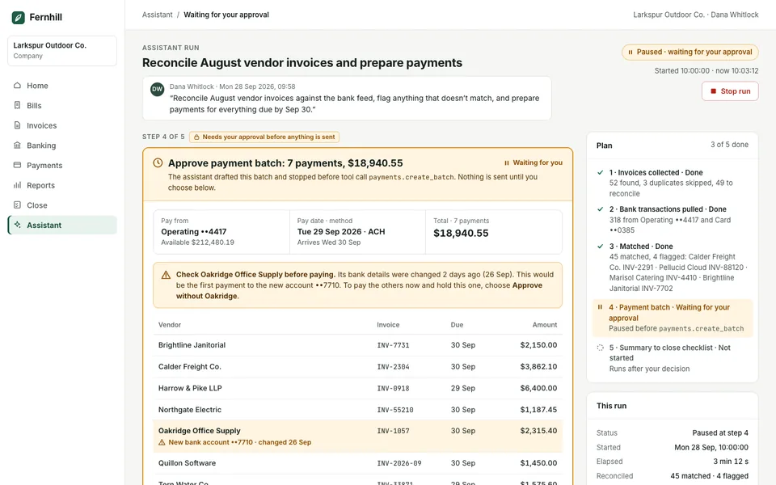 | 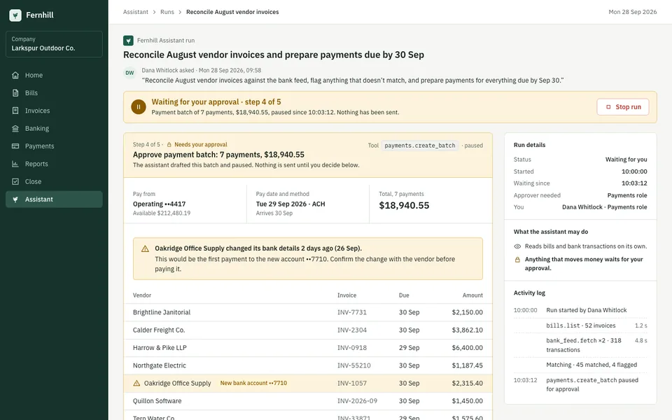 | 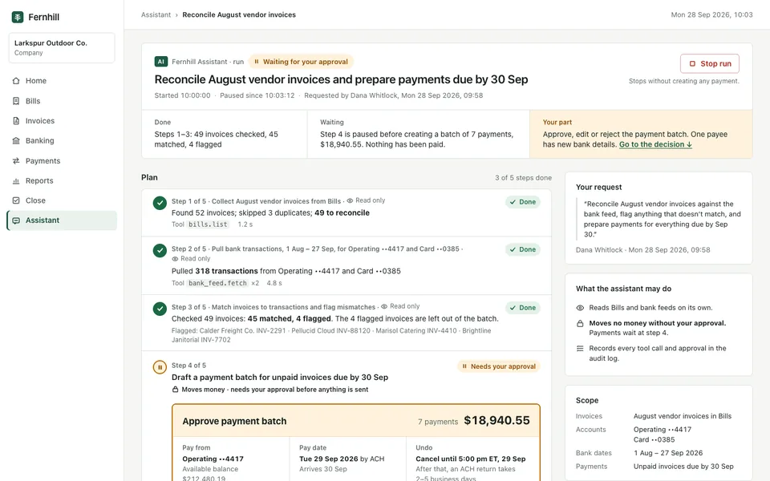 |

Judges' pairwise reasons (de-anonymised):

- J1, no-skill vs suite-0.8.0: **no-skill**. A leads the approval moment with the card, Oakridge warning and payees on the first screen; C nests the batch under step 4, pushing warning and choices below the fold.
- J1, suite-0.7.0 vs no-skill: **no-skill**. A's result lists the six scheduled payees with Cancel batch beside the cutoff and keeps the plan in a rail during approval; B hides the batch behind a link and repeats the plan below.
- J1, suite-0.7.0 vs suite-0.8.0: **suite-0.7.0**. B's approval card opens the page with warning and payee table visible immediately; C's batch sits inside step 4 and its decision starts on the second screen.
- J2, suite-0.8.0 vs no-skill: **suite-0.8.0**. C's Done/Now/Your-part strip, in-plan approval and ledger-ruled totals give clearer order and better money typography; A is clean but generic, with monospace invoice IDs cluttering tables.
- J2, suite-0.8.0 vs suite-0.7.0: **suite-0.8.0**. C keeps the decision inside the plan step with a jump link and strong figures; B's decision falls to frame 2 of a long page with the plan repeated below.
- J2, no-skill vs suite-0.7.0: **no-skill**. A's result leads with three large money tiles and its approval is tighter; B has more character (Plex, dark sidebar) but buries its outcome figures in small stat cells.
- J3, no-skill vs suite-0.8.0: **suite-0.8.0**. C's Done / Now / Your part strip says the state in words on every moment and keeps the approval inside the plan step; in A you piece it together from the header pill and side panels.
- J3, suite-0.7.0 vs no-skill: **no-skill**. A's result lists the scheduled batch with payees, a total and a Cancel batch action; B's result gives only a summary, and its error stacks two red panels.
- J3, suite-0.8.0 vs suite-0.7.0: **suite-0.8.0**. C shows the scheduled PB-0928 payee table and a status strip that stays the same across moments; B leaves out the batch detail on the result.

Facts (evals/tools/facts.mjs @ f5c0421, judged area only):

- no-skill: 4 of 4 files, 8 frames, 0 console errors, 0 files with horizontal overflow; text below AA 0 of 540 (lowest 5.18:1); targets under 24 px failing the spacing exception 0.
- suite-0.7.0: 4 of 4 files, 9 frames, 0 console errors, 0 files with horizontal overflow; text below AA 0 of 546 (lowest 4.75:1); targets under 24 px failing the spacing exception 0.
- suite-0.8.0: 4 of 4 files, 10 frames, 0 console errors, 0 files with horizontal overflow; text below AA 0 of 563 (lowest 4.55:1); targets under 24 px failing the spacing exception 0.

Rationale check (judging.md section 10):

- no-skill: claims: 11 verified, 0 contradicted, 1 not checkable.
- suite-0.7.0: claims: 11 verified, 0 contradicted, 1 not checkable.
- suite-0.8.0: claims: 9 verified, 2 contradicted, 1 not checkable.
  - Contradicted: "Hierarchy on every moment: 1) run header with a status chip and a Done / Now (or Waiting, Failed) / Your part strip; 2) the plan, with the active step expanded in place (progress, approval card, error…" Evidence: Holds on run-progress-01.png, run-approval-01.png and run-error-01.png. run-result-01.png contradicts 'every moment': the header has the 'Completed' chip but no Done / Now / Your part strip (three Scheduled / Held / Reconciled tiles instead), the plan becomes …
  - Contradicted: "Deliberately left: in Moment 2 the approve buttons sit below the payee table (y ≈ 1430). Dana reads account, date, undo window and the Oakridge warning above the fold, then the payees, then decides." Evidence: run-approval-01.png: Pay from, Pay date and the start of the Undo cell ('Cancel until 5:00 pm ET, 29 Sep') are above the 900 px fold, but the Oakridge warning box begins at y≈32 in run-approval-02.png, i.e. about 932 px, below the fold. Approve buttons sit at …

Identity leaks: none. Reviewer-addressed text: none (leaks.json).

### 06-redesign-legacy

Brief: [06-redesign-legacy.md](../../briefs/06-redesign-legacy.md). Mapping: A = no-skill, B = suite-0.7.0, C = suite-0.8.0.

**Winner: suite-0.7.0** (both pairs 3-0). suite-0.8.0 beat no-skill 2-1, with J3 dissenting. suite-0.7.0 labels the 10:15 double booking outright, writes appointment type as text codes and keeps an icon-and-text status key. suite-0.8.0 shows appointment type by colour stripe alone, truncates the double-booked cards ('Reyes, Lucas 3M · f…') and wraps '8:00 / AM' in the time column (Craft 3.0, the lowest cell of the round). All three arms score far above the legacy screen (R: 1.9 overall), and every arm put all 74 legacy functions on screen or accounted for them.

| Arm | Fit | Hierarchy | Identity | Craft | Typography | Platform / A11y | Overall |
|---|---|---|---|---|---|---|---|
| no-skill | 4.0 | 4.0 | 3.0 | 4.0 | 4.0 | 4.0 | **3.8** |
| suite-0.7.0 | 5.0 | 4.0 | 3.3 | 4.0 | 4.0 | 5.0 | **4.2** |
| suite-0.8.0 | 4.3 | 4.0 | 3.3 | 3.0 | 4.0 | 4.3 | **3.8** |
| legacy screen (R) | 2.0 | 1.7 | 2.0 | 2.3 | 1.7 | 2.0 | 1.9 |

First frames (canonical renders, `schedule.png`; full frames in each arm's `render/`):

| no-skill | suite-0.7.0 | suite-0.8.0 |
|---|---|---|
| 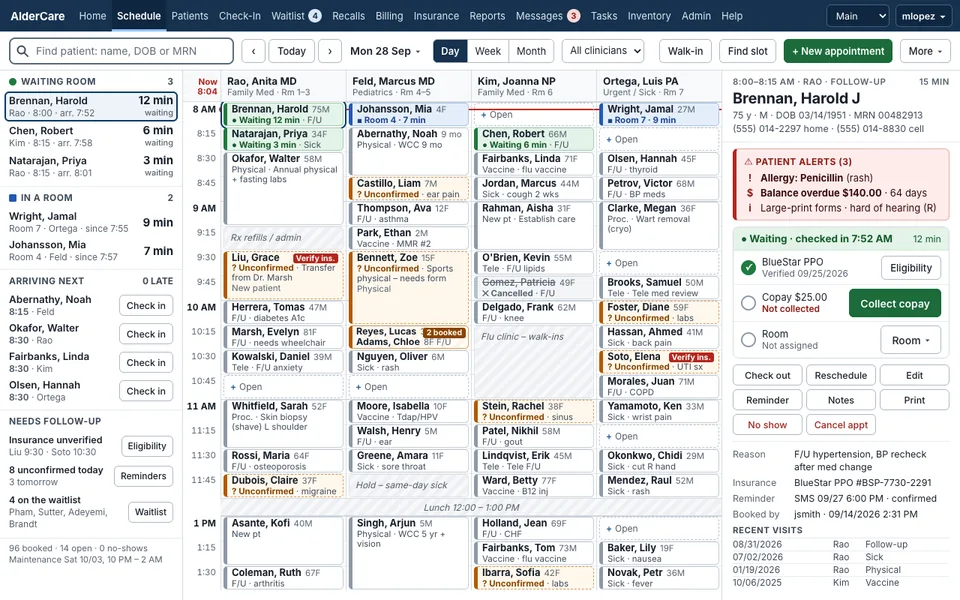 | 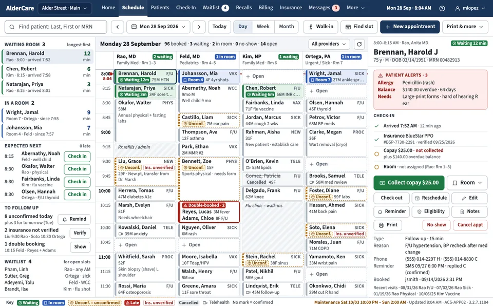 | 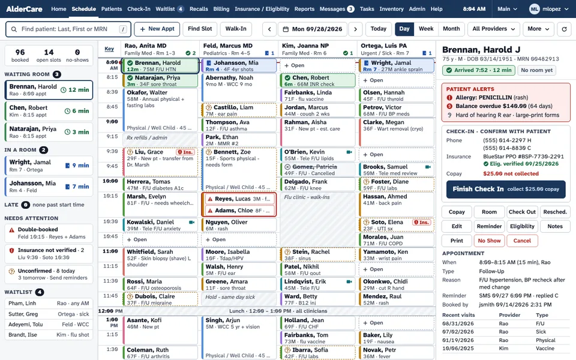 |

Judges' pairwise reasons (de-anonymised):

- J1, suite-0.7.0 vs suite-0.8.0: **suite-0.7.0**. B labels the double booking in the grid, shows waiting/in-room counts per clinician and has a status key for temps; C has cut-off card text and colour-only type stripes.
- J1, no-skill vs suite-0.7.0: **suite-0.7.0**. B makes the 10:15 double booking unmistakable, consolidates navigation and ties copay to the overdue balance; A's '2 booked' badge is small and all 14 tabs remain.
- J1, no-skill vs suite-0.8.0: **suite-0.8.0**. C keeps 'Check In' as the primary action and surfaces double booking, insurance and lateness in Needs Attention; A only hints at the double booking with a small badge.
- J2, suite-0.8.0 vs suite-0.7.0: **suite-0.7.0**. B's type system is tighter: right-aligned type codes, stacked minute numerals, explicit 'Double-booked' label. C wraps '8:00 / AM' in the time column and truncates repeated type footers.
- J2, no-skill vs suite-0.7.0: **suite-0.7.0**. B names the 10:15 double booking in a red frame and lays out check-in as a checklist; A marks it with a small badge and gives the panel less structure.
- J2, no-skill vs suite-0.8.0: **suite-0.8.0**. C makes 'Finish Check In' the primary action, flags the double booking in the grid and in Needs attention, and uses a hyperlegible face with slashed zeros. A's double booking is quieter.
- J3, suite-0.7.0 vs suite-0.8.0: **suite-0.7.0**. B gives type as text codes and a permanent status key, and arrivals get Check in buttons; C shows type by colour stripe alone and truncates the double-booked cards.
- J3, no-skill vs suite-0.7.0: **suite-0.7.0**. B labels the 10:15 double booking outright and keeps an icon-and-text status key visible; A's '2 booked' badge is small and there is no legend.
- J3, no-skill vs suite-0.8.0: **no-skill**. A writes appointment type in words and truncates less; C shows type by colour stripe alone and clips content ('Reyes, Lucas 3M · f...', '45 ...').

Facts (evals/tools/facts.mjs @ f5c0421, judged area only):

- no-skill: 1 of 1 files, 1 frames, 0 console errors, 0 files with horizontal overflow; text below AA 0 of 361 (lowest 5.27:1), 2 not measurable; targets under 24 px failing the spacing exception 0.
- suite-0.7.0: 1 of 1 files, 1 frames, 0 console errors, 0 files with horizontal overflow; text below AA 0 of 351 (lowest 5.34:1); targets under 24 px failing the spacing exception 0.
- suite-0.8.0: 1 of 1 files, 1 frames, 0 console errors, 0 files with horizontal overflow; text below AA 0 of 381 (lowest 5.75:1); targets under 24 px failing the spacing exception 0.

Rationale check (judging.md section 10):

- no-skill: claims: 11 verified, 0 contradicted, 1 not checkable; functions: 62 on screen, 12 accounted for, 0 missing.
- suite-0.7.0: claims: 9 verified, 2 contradicted, 1 not checkable; functions: 61 on screen, 13 accounted for, 0 missing.
  - Contradicted: "All twelve appointment actions in the right panel." Evidence: render/schedule.png: the right panel shows 11 action controls (Collect copay, Room, Check out, Reschedule, Edit, Reminder, Eligibility, Notes, Print, No-show, Cancel appt). Check in is not a control there: it appears only as the completed checklist step 'Arriv…
  - Contradicted: "Lunch (12:00–1:00) is compressed to a single band to keep the morning on screen; the grid scrolls for 1:00–1:30." Evidence: render/schedule.png: the grid shows 8:00 to the 11:30 row; the 11:45 row (only a sliver of the Dubois card border is visible) and the lunch band are below the fold, above the footer Key strip. The morning is not fully on screen without inner scrolling. About 3…
- suite-0.8.0: claims: 11 verified, 0 contradicted, 1 not checkable; functions: 62 on screen, 12 accounted for, 0 missing.

Identity leaks: none. Reviewer-addressed text: none (leaks.json).

## 5. Failures and reruns

- **None.** All 18 design runs ended by themselves inside the 60-minute limit (4.7 to 14.6 minutes), every required file rendered in every arm, and no arm was empty or partial. No reruns.
- No judge reply was malformed; no follow-ups were sent. The rationale checkers wrote their files in slightly different shapes; they were normalised into results.json without changing any verdict.
- **Isolation was not perfect, and not a breach under the README rule.** The grep check over all 18 transcripts found 0 hits. But `--safe-mode` in Claude Code 2.1.283 still listed 18 bundled host skills to every arm, including `design`, `design-sync` and `dataviz`, plus 4 plugins. `dataviz` was invoked in 3 runs (01 no-skill, 01 suite-0.7.0, 03 no-skill); `design` and `design-sync` were never invoked. The exposure was the same for every arm, but it means "no-skill" was "no suite", not "no skill". No arm was rerun for it: the exposure was identical across arms and is not a breach under the README rule.
- Two suite-0.8.0 runs imported Playwright from outside their work directory (a module import only; no repository skill or doc file was read).
- The mapping drew the same permutation for briefs 02, 04, 05 and 06 (A = no-skill, B = suite-0.7.0, C = suite-0.8.0). It was kept as drawn, per protocol. Pair order and sides were randomised per judge.

## 6. Cost per arm

From each run's final stream-json result event (`total_cost_usd`, list prices; tokens summed over the main session and its subagents). Judge and rationale-checker sessions were not metered and are not included.

| Arm | Wall total | Wall per brief | Range | Uncached input | Cache read | Cache write | Output (of which thinking) | $ total | $ per brief | Subagents |
|---|---|---|---|---|---|---|---|---|---|---|
| no-skill | 42 min | 7.0 min | 4.7-8.8 min | 232 | 6.4 M | 0.43 M | 250 k (83 k) | $9.77 | $1.63 | 0 |
| suite-0.7.0 | 57 min | 9.4 min | 5.0-12.2 min | 380 | 15.1 M | 0.78 M | 346 k (125 k) | $15.98 | $2.66 | 3 |
| suite-0.8.0 | 71 min | 11.8 min | 9.1-14.6 min | 598 | 26.3 M | 1.11 M | 418 k (155 k) | $21.74 | $3.62 | 6 |

Per brief, dollars and wall minutes:

| Brief | no-skill | suite-0.7.0 | suite-0.8.0 |
|---|---|---|---|
| 01-ops-console-zh | $1.57, 6.5 min | $3.24, 11.5 min | $4.07, 13.5 min |
| 02-devtool-landing-en | $1.62, 7.0 min | $2.49, 9.5 min | $2.91, 9.1 min |
| 03-ios-consumer-screen | $2.16, 8.8 min | $2.96, 10.0 min | $4.79, 14.6 min |
| 04-miniprogram-list-zh | $1.00, 4.7 min | $1.35, 5.0 min | $3.50, 10.9 min |
| 05-agent-approvals | $1.46, 6.0 min | $2.55, 8.4 min | $3.36, 9.6 min |
| 06-redesign-legacy | $1.96, 8.8 min | $3.39, 12.2 min | $3.12, 12.8 min |

suite-0.8.0 reads about four times as much cached context as no-skill (26.3 M vs 6.4 M cache-read tokens) and spawned a subagent in every brief (a fresh critic, as the suite asks). Quality per dollar is not better for the suites this round: suite-0.8.0 bought +0.17 on the mean for +$2.00 per brief.

## 7. Caveats

- **One sample per cell.** 18 runs show direction and failures, not a difference with confidence. A 5-1 split has a two-sided sign-test p of about 0.22. Before any release claim, run three or more samples per cell (judging.md section 9).
- **Judges share the model with the designers** (claude-opus-5-5 for all 18 design runs, all 18 judge sessions and all rationale checks). No other model family was available. Self-preference cannot be ruled out, and it could favour whichever arm writes most like the judge.
- **The scale compressed.** Only 3, 4 and 5 were used and judges never differed by more than 1 point. The means separate the arms by fractions of a point; the preferences carry the result. Next round the anchors need worked examples at 2 and 5, or the judges need to rank before they score.
- **Judge agreement may be too high to be independent.** Three lenses from one model agreed within 1 point on every score and were unanimous on 10 of 18 pairs. The lenses did split where they should have (brief 05: product versus visual and platform), but correlated judgement is likely.
- **Rubric alignment.** The six dimension names match the critique-design rubric, and the Identity name-swap test is also taught by both suites (judging.md section 11). This favours the suite arms, which makes the lack of a clear win more telling, not less.
- **lint.mjs ships with 0.8.0, and the arm used it.** suite-0.8.0's NOTES say it ran `lint.mjs` in all six briefs (contrast, overflow, accessible names). The facts judges saw come from the harness's own `evals/tools/facts.mjs` @ f5c0421, not from lint.mjs, so no arm was scored by its own checker. Where facts decided a Platform score: suite-0.7.0's 9 contrast failures in brief 01 (J3 cites them), and suite-0.8.0's sub-44 targets in brief 03 (5) and 04 (19). The linter did not stop those: lint.mjs reports touch targets under 44 × 44 only as a warning, and the floor the arm reported passing is contrast, overflow and accessible names.
- **Which 0.8.0 was tested.** The arm used `skills/` from commit df85492. The released 1a7830e differs in skills only by the refreshed catalogue listings, a CHANGELOG link and two consent-banner selectors in capture-core.mjs; none of that touches the design process.
- **"no-skill" still had host skills.** See section 5: the bundled `dataviz` skill was used in 3 runs.
- **The lab wrote the briefs, the judge notes and the suite.** The briefs name no skill and use no suite vocabulary, but the same authors decided what a good answer looks like. That can favour 0.8.0.
- **Static renders at fixed sizes.** Motion, interaction and other viewports were not judged. Nobody answered questions during runs, so every step where a suite would ask the user became the agent's own choice.
- **No human spot check this round.** judging.md section 11 recommends one; it has not been done.
- **Trigger eval ceiling.** The 0.8.0 trigger result is an upper bound: labels were written from the same role definitions as the descriptions, and the descriptions were written after the set existed.

## 8. What changes in the skills because of this round

Losses first. Each item names the evidence; none of these edits happens inside this round's report, and none of this round's outputs is re-scored.

1. **Marketing pages: the first viewport is measured, not asserted (brief 02, lost 3-0 to no-skill).** suite-0.8.0 said "the first viewport shows what it is, the install command and the code sample"; the render cut the code at the fold, and on mobile the plan CTAs were gone. Change in design-studio (`disciplines/marketing-sites.md`, `process/render-and-look.md`): for landing pages, list the must-be-above-the-fold elements in the brief and check them per viewport with a script (element bottom inside the viewport height) before the critic runs; mobile keeps every feature item and a persistent primary action unless the brief says otherwise.
2. **Craft is 0.8.0's weakest dimension (3.7, lowest of the three arms; 3.3 in 02, 3.0 in 06).** The defects are the kind a script can find: truncated labels and cards (02, 06), ellipsised names in the double-booked cell, '8:00 / AM' wrapping, straight quotes in display copy, broken inline code. Change: `lint.mjs` reports clipped or ellipsised text and unintended wraps inside the judged area; the craft checklist adds typographic quotes and inline-code rendering.
3. **Categorical colour needs a text partner too (brief 06, lost 3-0 to 0.7.0).** suite-0.8.0 kept the legacy type colours as stripes "so learned meanings hold" (the change-cost rule), but with no text, so type became colour only. All three judges named it. Change in `references/process/redesign.md`: a kept learned colour must be paired with a text code or legend on screen; status-without-colour applies to categories, not only to status.
4. **Touch targets and safe areas (brief 03, lost to 0.7.0; brief 04, 19 sub-44 targets).** suite-0.8.0's Log capsules and filter chips were under 44 pt, and its floating tab bar sat in the home-indicator inset. Its lint floor passed because `lint.mjs` reports touch targets under 44 × 44 only as a warning, and the NOTES quote the floor. Change: `touch-target` fails the floor when the target platform is touch (iOS, Android, mini-program); `platforms/ios.md`, `android.md` and `mini-programs.md` state 44 pt as a check the agent runs, and a safe-area check covers bottom bars.
5. **Rationale claims about layout must come from measurement (7 contradicted claims for 0.8.0, the most of any arm; 0.7.0 had 5, no-skill 1).** Examples: the Oakridge warning "above the fold" (starts at about 932 px, brief 05), "first viewport shows the code sample" (02), colours described in NOTES that the final render no longer used (01, where an earlier NOTES line survived a later change). Change: at close-out, every positional or colour claim in NOTES and rationale is re-checked against the final render, and superseded lines are deleted, not left beside the correction.
6. **Approval flows: the decision goes on the first screen (brief 05, J1 preferred no-skill and 0.7.0).** suite-0.8.0 nested the approval under plan step 4, so the warning and the approve buttons fell below the fold. Change in `references/disciplines/ai-experience.md`: when the run is waiting on the user, the decision block (what, how much, risk, approve / reject) is the first thing on screen; the plan context follows.
7. **Cost.** suite-0.8.0 costs 2.2 times no-skill for a difference the rule cannot call. Change: measure where the extra reading goes (26.3 M vs 6.4 M cache-read tokens) and cut the default reading path for single-screen and quick-tier jobs; report cost next to quality in the next round, as here.
8. **Keep, with evidence.** suite-0.8.0 won 01, 04 and 05 on hierarchy for the real task: readings and a labelled threshold chart on the detail's first screen (01), time-first service cards with four services above the fold (04), a Done / Now / Your part strip that states the run's status in words (05). Its Identity mean (3.7) is the highest of the three arms. These parts of the process stay.
9. **0.7.0 is not the baseline to beat.** It lost 4 of 6 briefs to no-skill. The honest comparison for future suite versions is no-skill, which scored 4.0 overall with the lowest cost.

Changes to the eval itself, for the next round (this round stays under the rules it ran with): judges from another model family if one is available; three samples per cell before any release claim; anchors with worked examples to fight score compression; a human spot check of at least two briefs; a blind-written held-out trigger set; and metering judge sessions so the total cost of a round is known.
